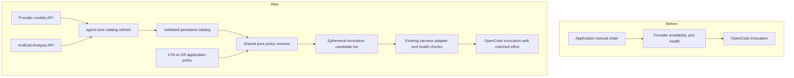

# Model Discovery Design

Status: approved direction; four review fixes approved and incorporated. Non-Jira work.
Spec: [approved requirements](spec-model-discovery.md).

## Contents
1. Architecture and scope
2. Contracts and data model
3. Control flow and policy
4. Operations and security
5. Verification and release
6. Decisions and changelog

## 1. Architecture And Scope

### 1.1 Before and after

### 1.2 Ownership

Shared discovery, normalization, filtering, and availability state live in a small
`agent_core/model_selection/` package. Provider HTTP and Artificial Analysis
parsing are adapters; the pure resolver accepts immutable data, not global
settings. OpenCode registration/variant translation stays in `harness/`.
Consumers own application policy and composition wiring, never score matching.
No Java/Python adapter changes. No new fallback classifications, progress
timeouts, billing rules, or mutation/enforcement policy changes.

Per-repo details:
- [agent-core](design-model-discovery-agent-core.md)
- [UTA](../../unit-test-agent/docs/design-model-discovery.md)
- [CR](../../cr_plugin/docs/design-model-discovery.md)

## 2. Contracts And Data Model

### 2.1 Shared value types

Use frozen dataclasses with validated JSON serialization, `schema_version=1`:

| Contract | Fields and purpose |
| --- | --- |
| ModelIdentity | provider, provider-local model ID; never infer provider from benchmark creator |
| BenchmarkRecord | stable AA ID, creator ID, name/slug, Coding Index or null, configuration metadata |
| ModelBinding | runtime identity, benchmark ID, canonical effort, adapter variant, capability approval |
| ModelPolicy | application ID, allowlist/null, denylist, minimum score (70), unscored approvals |
| CatalogSnapshot | provider inventory and benchmark records, fetched-at timestamps, source/schema, content digests |
| ResolvedSelection | in-memory ordered bindings for one invocation; never persisted on a task |
| ModelAvailability | credential scope, provider/model identity, reason, expiry; no list index |
| SelectionDecision | runtime identity, eligible flag, reason code; used by diagnosis, not full catalog in each task |

An application cannot supply credentials or override shared denials through a
policy. Explicit empty allowlist denies everything; null leaves the catalog
unrestricted by allowlist. Match with case-sensitive `fnmatchcase`, using the
full `provider/model` identity. Reject duplicate/conflicting bindings.

### 2.2 Database schema

No task-schema migration or new task fields. Do not store a chain in UTA config
snapshots or CR request_json for this feature. Mode comes from application config;
discovery-mode resumes ignore historical selected-model/index overrides.

Persist availability in an application-configured SQLite file under the cache
root, keyed by credential scope/provider/model, using transactional upserts and
existing health reason/expiry semantics. Applications sharing the same credential
scope may share this store; policy outcomes are never stored as health failures.
Catalog and availability caches are shared operational state, not task snapshots.
Credentials are never serialized. Retry/resume resolves current policy/catalog.

## 3. Control Flow And Policy

### 3.1 Refresh, then task creation

Provide a shared module command `python -m agent_core.model_selection refresh`
and a read-only `explain` command. Deployment installs an application-scoped
scheduled refresh job (no second task queue). The initial refresh is explicit
before enabling discovery. Task creation reads the local catalog; no benchmark
HTTP request in an API handler, LLM turn, or repair startup.

Refresh fetches the benchmark once and inventory once per provider, validates
both, and publishes an atomic snapshot only when the required inputs succeed.
Validation applies across all records before replacing last-known-good data.
Each worker loads current policy and resolves candidates before an agent
invocation. Resume follows the same path. Model eligibility failure is an
actionable task configuration error before any LLM billing, not a false success.
Enforcement-only CI jobs never need a model catalog.

### 3.2 Identity and effort matching

Use AA stable IDs for retained mappings. Bootstrap matching from exact known
aliases, not fuzzy similarity. A tested provider normalization may remove
version separators only if it produces a unique model AND effort match;
collisions stay unmatched. New unique recognized variants can join automatically;
unknown names/configurations show `benchmark_mapping_required` and await an
explicit binding. No per-model code edits are required.

Each application declares a default desired effort plus exact per-model effort
overrides. If AA provides effort only in its display name, an AA-specific parser
recognizes a bounded set of suffixes and preserves the raw name as evidence.
Unknown suffixes do not imply a default effort. Do not replace an unavailable
effort score with a higher-effort score, or substitute Coding Agent Index.

Match exactly, require finite unrounded Coding Index >= effective threshold,
then apply policy. Resolve the threshold in this order: production-owned
`AGENT_MODEL_CODING_INDEX_MIN` environment setting when present, application
`minimum_coding_score` when supplied, otherwise 70. The host reads operator
configuration once at startup and supplies the resolved policy to agent-core;
the resolver never reads process-global environment variables. Preserve zero,
reject blank/non-numeric/nonfinite/out-of-range [0,100] supplied values, and
log the effective value and its source. Neither task requests nor checked-out
repository configuration may override it. Production settings are per service,
so UTA and CR can use different thresholds without modifying shared code.
Allowlisting does not excuse a low score. Explicit unscored approval is distinct
from allowlisting and never overrides a known low score or shared denial.
Known embedding/image/audio-only models are excluded. Missing capability
metadata requires operator-approved capability bindings, not an assumption based
on a name. Explain output lists these pending models for approval.

The shared policy selector supports `best-score` (descending unrounded score,
then identity) and default `price-efficient` (discounted price, effort tier,
descending score, then identity; the former `best-efficient` name still loads).
Price is the OpenRouter input/output rates blended by the configured
`price_weights` (default 10:1, input-heavy), times the provider's
`pricing_discount` (default 1); a 0 discount ties every price and leaves the
efficiency ordering, an unknown price ranks after known prices, and `best-score`
ignores price entirely. Empty effort ranks alongside max without rewriting runtime
options. Tiers are none, minimal, low, medium, high, xhigh, max/default; unknown
labels come last. `bindings[identity]` accepts one binding or a nonempty list of
approved exact effort bindings. `variant_options[identity]` can map variant names
to effort options. Check admission and matching provider options for every variant
before ranking and choosing one per runtime model. An invalid preferred variant
must not hide a valid alternative; duplicate identity/effort/variant tuples fail.
Missing benchmark rows never inherit a sibling variant's score. Availability
remains scoped to the runtime model, so fallback does not retry the same unhealthy
model at different efforts. Approved unscored models remain last,
sorted by identity. `explain` includes the effective ranking strategy. There is no
preferred-model override in discovery mode. Health checks can skip
members of the current invocation list. Fallback disabled
selects the first healthy eligible member of that list and makes one
attempt; it does not truncate before checking eligibility.

### 3.3 Execution

Pass an explicit `selection_mode` (`manual` or `discovery`) to the shared
harness/runner. Discovery disables legacy preferred-model and last-success
promotion and the all-unhealthy retry escape hatch. The config builder must not
fall back to the first manual chain entry when discovery has no eligible member.
Keep all three legacy behaviors confined to manual mode. Both paths recheck
availability immediately before submission; all unavailable means a typed
`no_available_models` result with next retry time, zero paid submissions.

The harness resolves current cached selection when opening a new invocation.
Both reusable sessions and process-based turns ignore historical task-selected
model/index fields in discovery mode. Explicit requests cannot bypass descending
policy rank order. An in-memory attempted-identity set prevents cycling during fallback.
Do not reorder an in-flight call or live reusable conversation on cache refresh;
new invocations/resumes resolve again. Translate
each member's effort when opening that member, including fallback; do not carry
the previous model's variant into the next provider/model.

Preserve existing OpenCode config isolation and credentials. Register admitted
models and validated variants through the existing config builder. Unsupported
variant mappings fail before billing; they are configuration errors, not model
rate limits. Keep the current manual-mode behavior untouched.

The current typed `variant_options` contract is keyed by full runtime identity.
Each entry requires only `reasoningEffort`, with a value of `none`, `minimal`,
`low`, `medium`, `high`, `xhigh`, or `max`; extra SDK fields are forbidden.
Register these options explicitly under the binding's variant for custom providers.
A named variant without a mapping is excluded; `reasoningEffort` must exactly
match the binding's benchmark effort. Other adapters and effort mechanisms remain
pending until exact mappings are implemented and tested, not arbitrary SDK passthrough.

### 3.4 One availability authority

Inject an `AvailabilityStore` into discovery execution and resolution with
`status(scope, model)`, `record_failure`, `record_success`, and explicit
`clear_auth_quarantine(scope)` operations. Adapt the current tracker for manual
mode; discovery uses one SQLite-backed implementation, not a mirrored global
tracker. Route model-list authentication outcomes, process-runner failures,
reusable-session fallback failures and successes, and config checks through
that same instance. Reusable sessions recheck only before a new submission;
they do not switch active calls or alter billing bookkeeping.

Scope is `(provider_id, normalized_endpoint, credential_scope_id,
credential_generation)`. Operators increment the nonsecret generation when
rotating provider credentials. No credential material participates in task
evidence. Failure transitions reuse existing classification/cooldown durations.
Successful model calls clear only that model's transient state, not provider
authentication quarantine. A successful authenticated inventory refresh clears
only auth quarantine for that exact scope; it must not clear unrelated rate
limits. Inventory disappearance is catalog membership, not a permanent blacklist.
Persist auth failures at scope level so newly discovered models cannot evade them.
Concurrent writes are transactional; a success that predates a newer failure
cannot clear it (conditional update using observation time).

### 3.5 Shared deployment input

Use a trusted JSON file per service, outside target repositories, passed via
`AGENT_MODEL_SELECTION_CONFIG`. Both consumer composition and the refresh CLI
load the same schema in agent-core, independently of their legacy provider-chain
settings. Required keys: `schema_version`, `cache_root`, `availability_db`,
`providers` (id, trusted configured HTTP(S) base_url, credential_scope_id, credential_generation,
api_key_env), `bindings`, and `policy` (application_id and filters/minimum/effort).
AA requires HTTPS; trusted provider endpoints may use HTTP or HTTPS. Preserve the
approved internal HTTP endpoint rather than rewriting its transport. Named effort
variants also require the typed `variant_options` mappings described in section 3.3.
No literal secret values are allowed in this file. The benchmark key name is
canonical `ARTIFICIAL_ANALYSIS_API_KEY`, with the existing misspelled name accepted
only by the refresher. Production threshold environment precedence remains as
specified in section 3.2. The refresh operation validates the configuration but
does not apply application filtering to the raw catalog.

The shared command is `python -m agent_core.model_selection refresh --config
/etc/agent-model-selection/<service>.json`. Worker startup uses that same
absolute file path. No CWD-based .env discovery. Discovery configuration is
authoritative for provider endpoint/credential reference in this mode; reject
conflicting legacy provider settings rather than mixing scopes silently.

Ship an installer-generated `/etc/cron.d/agent-model-catalog` entry per service,
03:15 daily in the documented host timezone, using absolute interpreter/config
paths and a fixed launch script with `flock` to prevent overlap. The script loads
only its operator-owned refresh credential file, then execs the shared command.
Record last_success_at/last_error_code in a separate bounded refresh status file;
failed refresh exits nonzero and preserves cache. Service readiness/diagnostics
display refresh age/status without reading secrets. Manual initial refresh is
required before enabling discovery. No cron installation occurs during design.

## 4. Operations And Security

### 4.1 Bounds

Defaults: refresh daily (every 24 hours), acceptable cache age at most 7 days (both inputs
checked), 10 seconds per HTTP request and 30 seconds total refresh, 10 MiB decoded
response limit and 10,000 records per source. One benchmark request per refresh,
not per model/task. These are design budgets, not measured performance claims.
No inline retry storm; later scheduled refresh retries after failure.

Cache root is application-configured. Use a dedicated restricted group shared
by refresher and worker: operational directories 2770, files/SQLite sidecars
0660, umask 0007. Keep refresh credentials in a separate 0700 directory with
0600 files owned only by the refresher; workers are not members of that secret
owner identity. Test both identities' database access and worker denial of
credential reads on deployment. Use file
locking and atomic rename with same-filesystem temporary files. Partition by
provider endpoint and nonsecret credential-scope identifier; credential changes
invalidate/rebuild inventory. No plain or hashed API keys in evidence.
Reject unknown schema versions. Treat a backward clock jump as stale.

### 4.2 Failure handling

| Failure | Behavior |
| --- | --- |
| API timeout/429/5xx/malformed data | Retain valid cache; refresh error diagnostic |
| Auth failure | Mark credential scope unusable for new selections until successful refresh |
| Missing/expired cache | New discovery-mode task fails with refresh instructions |
| Model disappeared/temporarily unhealthy | Existing health classification, persisted by identity; next invocation uses refreshed catalog |
| No eligible candidate | Explain all exclusion reasons; no manual-chain bypass |
| Interrupted refresh | Prior atomic cache remains readable |
| Concurrent policies | Separate immutable inputs; no process-global policy mutation |

API keys use existing server-side secret loading. Accept existing local
`ARTIFICAL_ANALYSIS_KEY` as an input alias for canonical
`ARTIFICIAL_ANALYSIS_API_KEY`; never store its value in docs or task data.
In production provision the AA key only to the refresh launcher, not the worker
service. Use a separate refresh OS identity/credential file inaccessible to the
agent worker; publish the resulting nonsensitive catalog with worker-readable
ownership. Strip both AA key names from both process and server OpenCode child
environments, after applying all environment overrides. Do not pass a credential
file path into agent tools. Environment filtering alone is not a sandbox: if a
worker can read the refresh credential file, deployment isolation has failed.
AA requests require HTTPS. Provider HTTP is supported only through the trusted
operator-configured endpoint; this does not authorize arbitrary HTTP destinations.
HTTP redirects are disabled to prevent credentials following another host.
Benchmarks are untrusted data: whitelist fields, bound strings, never evaluate
commands or instructions from upstream. Scores displayed include AA attribution.

## 5. Verification And Release

### 5.1 Development verification

RED/GREEN tests cover all spec acceptance criteria: score 69.999/70/70.001,
production/application/default threshold precedence, valid zero, invalid overrides,
cross-application isolation, refusal of repository/task threshold overrides,
last-success/preferred/all-cooling escape-hatch regressions, transactional health
updates and scope rotation/auth recovery, synthetic AA secret sentinel absence
in process/server child environments after caller env overrides,
NaN/null/missing, duplicate aliases/variants, allowlist null versus empty,
denial precedence, strict descending ordering under shuffled inventories,
attempted preferred-model bypass, equal-score ties, approved unknowns last,
cache failure/auth/expiry/atomicity, and separate UTA/CR policy calls in both
orders. Verify both invocation paths and each fallback's actual effort.
Check legacy chain, fallback, cancellation, progress, budget and cost regressions.

Cross-layer tests create UTA batch and CI-repair tasks plus CR scan and fix
tasks, refresh catalog, restart/resume, and assert fresh policy ordering and effort,
retained identity-keyed cooldowns, and no cross-application policy leakage.
Exercise real OpenCode config generation
with a recording transport so wrong variants or model registration fail tests.
Run the real refresh launcher with a fixture HTTP server/config and worker loader
to prove identical cache root/scope before and after credential rotation. Assert
job exit/status evidence for failures and a valid daily cron entry. Keep direct
network access out of worker invocation tests.
Run full relevant suites, Python enforcement, package builds, and five-axis review.

### 5.2 Live and deployment verification

Authenticated AA fetch already succeeded locally; this alone is not end-to-end
verification. Compare live token-pool inventory to score bindings, report all
exclusions and unscored cases, and validate tool-capable execution for initial
approved bindings. Do not infer local results prove production configuration.

Release agent-core first, pin release in both consumers, install refresh job,
populate production cache, then enable application discovery after checking
enforcement and repair queues are idle. Verify one UTA repair and one CR task:
catalog/score/effort provenance, actual provider/model/variant, progress and cost.
Rollback disables discovery for subsequent invocations and resumes. No task
snapshot migration is needed. Active calls/tasks must not be restarted for rollout.

## 6. Decisions And Changelog

ADR: [shared admission and fresh resolution](decisions/ADR-model-discovery.md).
Rejected: live leaderboard queries per turn (latency/outage coupling), highest
score across efforts (misrepresents runtime), consumer-side selectors (drift),
and replacing fallback classification (outside scope).

Open rollout inputs: approved model capability/effort bindings and application filters
for each application. Default threshold 70 is settled; production may supply its
own validated threshold. These rollout inputs must not be guessed.

- 2026-09-16: Blend input and output rates by configurable `price_weights`
  (default 10:1) rather than summing them 1:1, which ranked cheap-input frontier
  models as expensive. Records cache the two rates unblended.
- 2026-09-16: Added provider `pricing_discount` and renamed the efficiency ranker
  to `price-efficient`: cheapest first, prior efficiency order within equal
  prices. Daily refresh caches OpenRouter public list prices; a pricing-source
  failure keeps the last prices instead of staling the catalog.
- 2026-09-07: Initial design, based on approved spec and code inspection. Includes
  both OpenCode entrypoints and task persistence rather than selector-only changes.
- 2026-09-15: Empty/default effort ranks as max, not medium. Ranking only; do
  not rewrite the bound effort or send a max reasoning option for unsuffixed rows.
- 2026-09-07: Added configurable best-score/best-efficient ranking, efficient by
  default; empty effort originally ranked as medium. Superseded 2026-09-15.
- 2026-09-07: Added multiple exact bindings per runtime identity; validate each
  variant before deduplication and wire only its selected provider options.
- 2026-09-07: Strict descending score ordering requested by user; removed
  preferred-model precedence and prohibited runtime overrides from jumping order.
- 2026-09-07: Removed per-task snapshots and persistent fallback indices at user
  request. Retain scoped availability across resume; resolve current list each invocation.
- 2026-09-07: Daily refresh and production-owned threshold override added, with
  explicit precedence, validation, policy isolation, and trusted config ownership.
- 2026-09-07: User approved fixing all four design-review findings. Specified
  discovery execution mode, one availability authority with recovery, refresh-only
  AA credentials plus child-env filtering, and shared deployment config/launcher.
