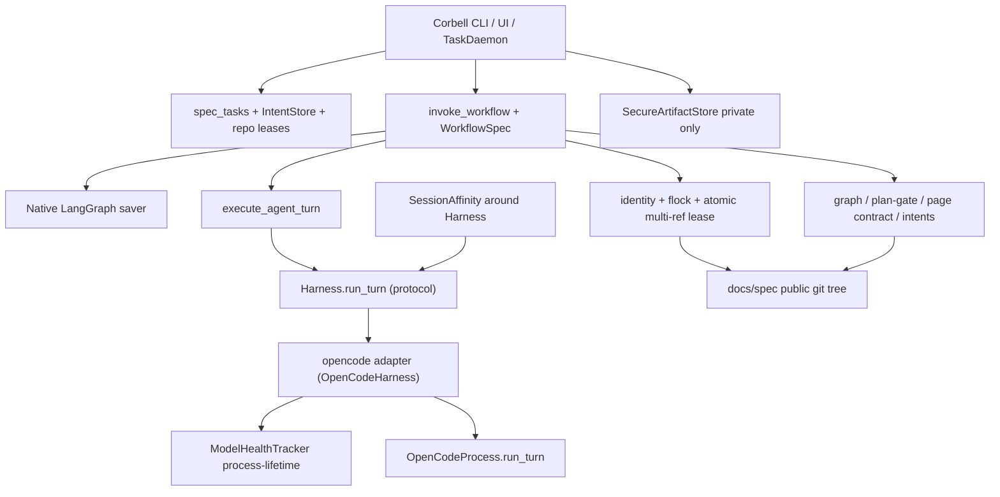

# Design Overview: Spec-Gen (Corbell) Agent-Core Adoption

## Status And Traceability

- Status: **approved by the user on 2026-08-26** (`approve`); frozen for
  planning. **Pending increment 2026-08-26:** product writer path is
  `Harness` + `SessionAffinity`, not a Corbell import of `OpenCodeHarness`.
- Review dispositions: pass-1–5 findings fixed before freeze.
- Approved source: `docs/spec-spec-gen-agent-core-adoption.md` (approved 2026-08-25)
- Work type: non-Jira multi-repository tooling iteration
- Affected repositories: `agent-core`, `Corbell` (`spec-generator-agent`)
- Compatibility: last `0.7.x` remains the UTA/CR pin until they opt into `0.8.0`
- Detail designs:
  - `docs/design-spec-gen-agent-core-adoption-agent-core.md`
  - `Corbell/docs/design-spec-gen-agent-core-adoption.md`
- Usage: `docs/usage-spec-gen-agent-core-adoption.md`
- ADRs:
  - `docs/decisions/ADR-005-breaking-08-for-reuse-first-harness-and-git.md`
  - `docs/decisions/ADR-006-lease-fenced-multi-ref-git-update.md`
  - Corbell `doc/decisions/ADR-015-adopt-agent-core-and-langgraph.md` (supersedes ADR-001)

## Contents

1. [Goals And Non-Goals](#goals-and-non-goals)
2. [High-Level Design](#high-level-design)
3. [Intra-System Relationships And Cooperation](#intra-system-relationships-and-cooperation)
4. [Canonical Contracts](#canonical-contracts)
5. [Data Dependency Flow](#data-dependency-flow)
6. [Key Process Flows](#key-process-flows)
7. [Key Design Tradeoffs](#key-design-tradeoffs)
8. [Capacity, Reliability, And Security](#capacity-reliability-and-security)
9. [Failure-Mode Handling](#failure-mode-handling)
10. [Rollout Plan And Strategy](#rollout-plan-and-strategy)
11. [Verification Plan](#verification-plan)
12. [First-Principles Check](#first-principles-check)

## Goals And Non-Goals

### Goals

1. Corbell calls public agent-core APIs for spawn/stream, structured JSON turns,
   session affinity, fallback cooldowns, shutdown, `TaskDaemon`, git identity,
   inter-process repo locks, and lease-fenced multi-ref git update.
2. `context-prepare` and `spec-docs` orchestration are `WorkflowSpec` graphs
   invoked through `invoke_workflow`.
3. Agent-core `0.8.0` holds the new contract. Additive knobs are used where the
   old shape already works; the listed public behaviors change and bump major.
4. Product policy stays in Corbell: wiki page contracts, architecture graph,
   intents, downstream activation, `spec_tasks`.

### Non-Goals

- Moving graph/wiki/intents/MCP/Jira/Linear/Notion into agent-core.
- Using `PublicationCoordinator` or shared `prepare_workspace` for wiki publish
  or dual-ref checkout.
- Human plan-approval inbox (`human_gate`).
- LangGraph rewrite of leftover `LLMClient` PRD CLI flows.
- Requiring UTA/CR source migrations unless they install `0.8.0`.
- Putting wiki markdown in LangGraph state or `SecureArtifactStore`.

## High-Level Design

Agent-core `0.8.0` extends three existing packages. Corbell deletes its copies
and describes spec pipelines as YAML graphs, the same way CR describes reviews.



## Intra-System Relationships And Cooperation

| Repo | Owns | Consumes |
| --- | --- | --- |
| agent-core | harness knobs, affinity+bootstrap, cooldowns, `agent_turn` parse/message, flock, multi-ref lease update, placeholder expander | nothing from Corbell |
| Corbell | YAML workflows, product nodes, `spec_tasks`/intents, wiki/graph policy, DaemonPorts, `HarnessSpec.options` | agent-core `0.8.0` extras `api,langgraph,yaml`. **Does not import `OpenCodeHarness`.** |
| UTA, CR | stay on last `0.7.x` until they opt in | must not import `0.8.0` until a matched pin |

Sequencing: release agent-core `0.8.0` → pin Corbell → migrate daemon → context-prepare graph → spec-docs graphs → delete `core/opencode` spawn path.

## Canonical Contracts

### Release

- Tag: **`0.8.0`**. Last compatible old-consumer tag remains `0.7.9` (UTA) /
  `0.7.6` (CR). Mixed pairs are unsupported (ADR-005).
- Corbell pin test refuses anything except the released `0.8.x` this iteration
  targets.

### Product harness contract (agent-agnostic)

Corbell, UTA, and CR **will** construct a harness only through
`create_configured_harness(HarnessSpec(name=…, options=…))` and type nodes
against `Harness`. They **will not** import `OpenCodeHarness` in product
workflow code (same rule as the agent-core README).

`SessionAffinity.run` takes a `Harness` (anything with `run_turn`). Writer:

```text
write_page
  → create_configured_harness(HarnessSpec(name="opencode", options={...}))
  → SessionAffinity.run(harness, page_key, message=…, bootstrap_message=…)
       → harness.run_turn(...)
```

OpenCode-only knobs (`delivery`, `title`, `pure`, `env`, `project_dir`,
`isolate_attempts`, permission maps, lane workspace factory) live in
`HarnessSpec.options`. The registered `"opencode"` adapter interprets them.
`OpenCodeHarness` remains the adapter implementation and the 0.8 change
site; it is not a product API.

Also considered: Corbell `write_page` importing `OpenCodeHarness`. Rejected:
that contradicts agent-agnostic design and forces a second import path when
a deployment selects another registered name.

### Breaking public behavior (0.8.0)

Who moves: **Corbell** pins 0.8. **UTA and CR stay on last 0.7.x** this
iteration. SessionAffinity is test-only in 0.7; CR calls `repo_lock`; UTA
and CR call `create_configured_harness` → registered `"opencode"` adapter
(`OpenCodeHarness.run_turn` → `run_turn_with_fallback`).

| Symbol | 0.7.9 observable | 0.8 observable | UTA | CR | Corbell |
| --- | --- | --- | --- | --- | --- |
| `OpenCodeHarness.run_turn` | `session_id` swallowed; **requires** `prompt_file` | Accepts `message` xor `prompt_file`. Forwards `session_id`, `delivery`, `title`, `pure`, `env`, `project_dir`, `bootstrap_message`. First candidate: continue if `session_id`. Later candidates: **fresh** session (never `--continue`). `message=bootstrap_message` **iff set**; otherwise keep original `message`/`prompt_file` | stay 0.7 | stay 0.7 | required |
| `run_turn_with_fallback` | No `session_id` / per-candidate message | `session_id` on **first** candidate only. Later candidates: drop `session_id`; `message=bootstrap_message` **iff set**, else original payload. Signature break. | stay 0.7 | stay 0.7 | required |
| `SessionAffinity.run` | `process.run_turn` only; session_id only | Calls **harness** `run_turn`. Model match → `session_id` + current message. Mismatch **or mid-chain failover** uses `bootstrap_message`. | n/a (tests) | n/a | required |
| `run_turn_with_fallback` + `ModelHealthTracker` | Explicit `models=` does **not** skip unhealthy. rate_limit 120s, other 15m, `no_output` 10m. All-cooling with default chain → empty → error | Skip unhealthy even when `models=` is set. rate_limit **60s**, model_unavailable 15m, **timeout 5m**, no_output 10m. Prefer last-success. If **all** cooling, try anyway (changes UTA/CR default path **if they install 0.8**). Process-lifetime tracker only | stay 0.7 | stay 0.7 | required |
| `GitWorkspace.repo_lock` | in-process `RLock` | POSIX `fcntl.flock` + `RLock`. Production is POSIX; Windows is unsupported for this lock | n/a | stay 0.7 | required |
| `run_harness_node` | always `prompt_file=` | `str` from the prompt callable → `message=`; `Path` → `prompt_file=`. Forwards delivery/title/pure/session_id | stay 0.7 | stay 0.7 | required |

Also considered: a new `AffinityFallbackRunner` type. Rejected: the
`Harness.run_turn` implementation already walks fallback; the `"opencode"`
adapter must stop ignoring `session_id` and must pass `bootstrap_message` on
failover. Affinity wraps **`Harness`**. `execute_agent_turn` does **not** own
affinity; product `write_page` calls
`SessionAffinity.run(harness, key, message=continuation, bootstrap_message=full)`
where `harness` came from `create_configured_harness`.

### Additive public API (same 0.8.0 tag)

- `OpenCodeProcess.run_turn(..., delivery="argv"|"file"|"stdin", title=..., pure=...)`.
  Default delivery remains argv/`--file` at the 60k threshold.
- `AgentTurnRequest.prompt` callable may return `Path` **or** `str`.
- Shared `agent_turn` is for planner/keyword JSON only. It accepts an
  in-memory message **or** a file that **must** be under `context["turn_dir"]`
  and **must not** be under `Path(repo_path)/"docs"/"spec"`. Spec-gen does
  **not** use shared `render_prompt`.
- `write_page` is a **Corbell product node**, not shared `agent_turn`. It
  holds a `Harness` from `create_configured_harness`, not `OpenCodeHarness`.
- `OpenCodeProcess.run_turn` also takes `env=` and `project_dir=` (`--dir`).
- `render_placeholders` in `prompts.py`: exact `{{name}}`; unknown names fail.
  Unused-key checking stays in Corbell's wrapper.
- `update_refs_with_lease(workspace, path: Path, *, ref_updates, lease, is_cancelled=None)`:
  `workspace.execute(path, "push", "--atomic", *lease_args, "origin", *refspecs, check=True, is_cancelled=is_cancelled)`.
  Corbell passes `PreparedProject.repo_dir`, **not** `path_for(repo_url)`.
  Fail closed if the remote rejects `--atomic`. Empty expected SHA is explicit.
- Named permission maps stay product-injected. They are **not** the writer
  sandbox: Corbell sets `isolate_attempts=False` and a workspace factory that
  yields the existing lane scratch (`HOME`/`XDG_*`/`PATH`/`OPENCODE_CONFIG`).

### Workflow topology (product YAML, core engine)

Three graphs, names frozen:

- `context-prepare` — linear stages + keyword-plan retry branch.
- `spec-docs-service` — one service: nested context-prepare, impact, plan-gate
  branch, **batched** page fan-out, review branch, promote.
- `spec-docs` — sequential `select_next_service` loop, nested service graph,
  aggregate, publish.

Fanout `collect` is **append-only**. It is **not** the writer ledger.

- Per-wave collect key: `wave_results` (`item_key: page`).
- Last-write-wins map in graph state: `page_status: {path: "ok"|"failed"|"retry"}`.
- `join_pages` upserts `page_status` from this wave, then clears `wave_results`
  is optional; the map is authoritative.

`write_page` **must** wrap the item under the collect key (live CR pattern):

```python
return {"wave_results": {"page": path, "status": status, "error": error}}
```

`select_page_batch` (frozen). Load `plan` / `context_pack` from paths:

```text
ok      = {p for p, s in page_status.items() if s == "ok"}
failed  = {p for p, s in page_status.items() if s == "failed"}
# retry pages are absent from ok/failed so they re-enter the frontier
if len(failed) >= 4:
    page_batch = []
else:
    ready = _page_write_batches(
        plan, write_order,
        completed_paths=ok,          # failed child does NOT count as done
        context_pack=context_pack,   # same-seed twins
    )[0] or []
    ready = [p for p in ready if p not in failed]  # never re-Send failed
    page_batch = ready[:lanes]
FanoutSpec.over = page_batch   # never write_order
```

A failed child **blocks** its parent (`completed_paths` is ok-only) and is
**not** re-Sent. Independent siblings still proceed.

`select_page_batch` cannot also be a branch source. **`join_pages` is the
branch source.** Empty `over` skips to join.

```yaml
fanout:
  - from: select_page_batch
    over: page_batch
    node: write_page
    join: join_pages
    item_key: page
    collect: wave_results
    max_parallel: <lanes>
branches:
  - from: join_pages
    selector: writer_join_outcome
    routes:
      continue: select_page_batch
      review: review_docs
      fail: mark_failed
  - from: review_docs
    selector: review_outcome
    routes:
      passed: promote_service
      repair: select_page_batch    # after mutating page_status
      fail: mark_failed
```

`writer_join_outcome` uses **unique failed pages** (`page_status`), not
collect-row count:

- last `page_batch` nonempty and `len(failed) < 4` → `continue`
- last `page_batch` nonempty and `len(failed) >= 4` → `fail`
- last `page_batch` empty and `failed` empty → `review`
- last `page_batch` empty and `failed` nonempty → `fail`

**Review repair (one path, both docs):** `review_docs` sets each retry path
in `page_status` to `"retry"` (or deletes those keys) **then always**
`select_page_batch`. It does not write `page_batch` itself and does not
append onto `wave_results` expecting a replace. Select then re-queues only
those paths (not `ok`, not `failed`).

Isolatable page failures: `write_page` returns status under `wave_results`;
it does **not** raise. `MODEL_BUDGET` **does** raise. This **is a behavior
change** vs today's `if outcome.failures: raise` after a DAG level: the
graph continues independent ready pages after 1–3 unique isolated failures,
then `mark_failed` when the frontier is empty or unique failures ≥ 4.

Failure channel for isolatable / plan-gate / coverage fail: node
`mark_failed` sets `run_status="failed"` then END. Success `promote_service`
sets `run_status="ok"` then END. Do **not** raise on isolatable failures
(that would resume the failed node, not `reused_completed`).

Nested invoke uses `WorkflowRunIdentity` only. Nested node:

- `reused_completed` and `run_status == "ok"` → success
- `reused_completed` and `run_status == "failed"` → fail; mint a **new**
  `workflow_run_id` before re-invoke
- `reused_completed` and **missing** `run_status` → **corrupt**, fail closed
  (do not treat as retry)
- Mint/write sites: `mark_failed` and `promote_service` write `run_status`;
  `DaemonPorts.execute` mints on task retry; nested node mints before
  re-invoking a failed unit.

`WikiPlanGate` is a branch selector, not `human_gate`.

Nested invoke is a Corbell product node calling `invoke_workflow` with a
child `WorkflowRunIdentity` (`product="specgen"`, `cycle` in
`{context-prepare, spec-docs, spec-docs-service}`, `version="v1"`,
`task_id`, `unit_id=service_id or "-"`, `workflow_run_id`). No parallel
thread-id grammar. `reused_completed` means the lineage finished, **not**
product success: inner failure mints a new `workflow_run_id` before retry;
outer resume must not skip a failed inner graph. Also considered: shared
`invoke_child_workflow` node; rejected as one-call glue.

### State vs files

Graph state: `task_ref`, `service_id`, `repo_path`, path/hash keys, page path
lists, `page_batch`, `wave_results` (per-wave collect), `page_status` (LWW
map), iteration counters, `run_status`.

On disk: wiki pages (`atomic_io` under `docs/spec`), drafts, impact manifests,
stage evidence, publication bundles (`SecureArtifactStore`).

## Data Dependency Flow

```text
Git source + spec-doc-gen refs
  → product wiki checkout (core identity + flock + fetch)
  → graph sqlite / history / live facts (product)
  → context pack file (path+hash in state)
  → plan JSON file → WikiPlanGate (product)
  → selected page paths in state
  → write_page fan-out → page files + join upserts page_status
  → review (product) → set retry keys in page_status → select_page_batch
  → promote into docs/spec
  → update_refs_with_lease (core) using Corbell refs + fencing token
spec_tasks stays operator truth; LangGraph saver is graph position only
```

## Key Process Flows

### End-to-end spec-docs task

```mermaid
sequenceDiagram
    participant D as TaskDaemon
    participant P as DaemonPorts (Corbell)
    participant G as invoke_workflow
    participant T as execute_agent_turn
    participant O as OpenCodeProcess
    participant Git as update_refs_with_lease

    D->>P: claim (IntentStore / spec_tasks)
    P->>P: backup wiki output dirs
    P->>G: WorkflowRunIdentity specgen/spec-docs/v1
    G->>G: nested context-prepare if needed
    loop plan-gate retry bounded
        G->>T: wiki plan JSON via agent_turn stdin or turn_dir
        T->>O: Harness.run_turn (opencode adapter: stdin, title)
        G->>G: WikiPlanGate branch
    end
    loop join_pages continue → select_page_batch until empty batch or failures >= 4
        G->>G: select_page_batch recomputes ready[:lanes]
        G->>G: write_page product node
        Note over G: Affinity + harness; failover uses bootstrap_message
        G->>O: first candidate continue; later candidates bootstrap
        G->>G: writer_join_outcome continue|review|fail
    end
    G->>G: mark_failed sets run_status=failed then END
    G->>G: review only if failures empty; promote sets run_status=ok
    G->>Git: execute(repo_dir) git push --atomic --force-with-lease
    P->>P: restore backups on uncaught failure
```

### Crash resume

Pending checkpoint + `invoke(..., None)` continues at the next node. Stage
hash-skip inside a visited node still no-ops matching evidence. A **successful**
completed inner lineage is `reused_completed`. A **failed** inner lineage
(plan-gate/page fail → END) must not be reused as success: mint a new
`workflow_run_id` and invoke with initial state.

## Key Design Tradeoffs

| Decision | Choice | Rejected | Why |
| --- | --- | --- | --- |
| Release | **0.8.0** with the break table above | Stay `0.7.10` additive-only | Harness session forwarding, model-bound affinity, tracker skip on `models=`, POSIX flock. ADR-005. |
| Writer runner | `SessionAffinity` around `Harness.run_turn`; product uses `HarnessSpec` / `create_configured_harness` | Import `OpenCodeHarness` in Corbell; affinity inside `execute_agent_turn`; new runner type | Agent-agnostic contract. OpenCode session/fallback bugs are fixed **in** the `"opencode"` adapter, not by leaking the class. |
| Cooldown | Extend `ModelHealthTracker` | Second map on `run_turn_with_fallback` | The function is per-call; Corbell cooldowns are process-lifetime. |
| Wiki publish | `update_refs_with_lease` with `--atomic` | `PublicationCoordinator` or non-atomic push | Partial ref update is stolen fencing. ADR-006. |
| Page parallelism | Recompute `_page_write_batches` after each wave, then `ready[:lanes]` | Precompute all DAG levels and index | Remainder of a level would be skipped; parents could write before children. |
| Isolated-failure stop | Continue siblings after 1–3 unique isolated failures; `mark_failed` when frontier empty or unique failures ≥ 4 | Live `if outcome.failures: raise` after a DAG level | **Behavior change.** Collect-row fail-fast would starve siblings or retry the first failed path. LWW `page_status` + unique-page join. |
| Writer progress state | Per-wave `wave_results` + LWW `page_status` | Derive completed/failures from FanoutSpec.collect | Collect is append-only; review repair cannot replace `ok`. |
| Writer sandbox | `isolate_attempts=False` + lane-scratch factory + `env`/`project_dir` | Permission maps only | Page-lint HOME/PATH/`--dir` are not a permission dict. |
| Git helper path | `path: Path` = `PreparedProject.repo_dir` | `repo_url` / `path_for` | Wiki cache is not GitWorkspace's clone cache. |
| Plan gate | Graph branch | `human_gate` | Automated validator with bounded replan. |
| Nested graphs | Product `invoke_workflow` node | Shared child-workflow node | One-call glue; UTA already does this in-product. |
| Prompt expander | New exact `{{name}}` helper beside Jinja | Rewrite Corbell templates as Jinja | Nested expansion would change writer inputs. |
| UTA/CR this iteration | Remain on last `0.7.x` | Force 0.8 source migrations now | Spec allows them to opt in; Corbell is the required consumer. |

## Capacity, Reliability, And Security

- **OpenCode turns:** one planner turn per plan-gate iteration (≤3), plus one
  write/repair turn per selected page. Each Send wave is at most `lanes`
  (typically 1–4) **and** a dependency-ready subset. Estimate: tens to low
  hundreds of CLI processes per task.
- **Inner `recursion_limit`:** let
  `waves = sum(ceil(len(level)/lanes) for level in _page_write_batches(...))`
  (worst case: no isolated failures) plus review-repair waves.
  Limit =
  `(plan_iters * plan_nodes) + waves * (2 + lanes) * (1 + review_iters) + promote + 32`.
  **Outer:** `O(services) + 16`. Tests **must** invoke a large independent
  write-order (one DAG level, many pages) against that number. Default 25 is
  not enough.
- **Checkpoints:** small JSON state; saver file owner-only `0600`, no overlap
  with the repo (existing path rules).
- **Git:** flock serializes daemon vs UI vs publish. Lease token is product
  fencing; core only compares the token the caller supplies.
- **Secrets:** git token via `env_with_identity`; never in graph state or logs.
- **Idempotency:** `reused_completed` for finished lineages; force-with-lease
  fails closed on token mismatch rather than overwriting.

## Failure-Mode Handling

| Failure | Detection | Containment | Blast radius |
| --- | --- | --- | --- |
| Corrupt LangGraph checkpoint | `WorkflowCheckpointError` | Fail closed; mint new run id to rerun | Repeat paid turns; wiki unchanged |
| OpenCode cancel / lease loss | `is_cancelled` → cancelled turn | Task failed/interrupted; no empty JSON success | In-flight page discarded |
| Plan-gate exhausted | branch `fail` | Task fails; backups restore wiki tree | No publish |
| Isolated page failures | select empties batch at 4; join `fail` → `mark_failed` `run_status=failed` END | Task failed; remaining unwritten | No review of a partial writer set; no raise on isolatable |
| Inner graph failed then outer resume | `reused_completed` on fail END | New `workflow_run_id`; rerun inner | Avoid skipping a failed prepare/plan |
| Publish lease lost | git helper error | No partial ref update; task failed | Remote wiki unchanged |
| Mixed 0.7/0.8 install | consumer pin tests | Refuse start | None |

Wiki output-dir rollback stays in `DaemonPorts.execute`, outside the graph.

## Rollout Plan And Strategy

1. Land agent-core `0.8.0` tests + tag. Do not delete 0.7 APIs that still exist;
   change only the three behaviors above and add the additive knobs.
2. Corbell pin `v0.8.0` (or the shipped tag), pin test, `TaskDaemon`.
3. `context-prepare.yaml` + product nodes; keep old runner behind a flag only if
   tests need a one-PR rollback — default is graph-only once green.
4. `spec-docs-service.yaml` then outer `spec-docs.yaml`; delete
   `OpenCodeCliProcess` / `OpenCodeClient.run_json` spawn path.
5. Supersede Corbell ADR-001.
6. UTA/CR: no required PR. They stay on `0.7.6`/`0.7.9` until a later matched
   bump.

Rollback: revert Corbell pin + workflow commits. Leave `0.8.0` published; old
consumers never install it.

## Verification Plan

- Agent-core: two-candidate failover uses **bootstrap_message**, not the
  continuation; harness `message` xor `prompt_file`; tracker skip on `models=`
  across two turns; flock two-process POSIX; `run_harness_node` str vs Path;
  `update_refs_with_lease(path=checkout)` `--atomic` neither-ref-updated;
  `agent_turn` refuses a prompt file under `repo_path`.
- Corbell: pin; hash-skip; YAML join continue/review/fail; LWW `page_status`;
  parent-before-child with **one isolated failure** (siblings proceed, failed
  path not re-Sent, parent of failure not written); review retry of an `ok`
  page Sends again; `write_page` returns `{wave_results: item}`; bootstrap
  iff set (writer vs planner); `--atomic` + `is_cancelled`; missing
  `run_status` corrupt; `isolate_attempts=False` + lane factory.
- Compatibility: UTA and CR suites on **last 0.7.x**, not on 0.8, this
  iteration.
- Operator: daemon cancel, resume after kill, one dry-run spec-docs path.

## First-Principles Check

1. **Goal (from spec):** Corbell runs on released agent-core — LangGraph
   workflows, shared harness/git/daemon — without a parallel OpenCode stack,
   while wiki/graph/intents stay product.
2. **Simplest right solution:** extend the registered `"opencode"` adapter /
   `ModelHealthTracker` / `GitWorkspace.execute`; products keep
   `Harness` + `SessionAffinity`; YAML + product nodes; recompute
   `_page_write_batches` per wave. Not a new orchestrator, not
   `PublicationCoordinator`, not a second cooldown map, not a Corbell
   import of `OpenCodeHarness`.
3. **Production proof:** pin 0.8; kill -TERM after plan; parent before child
   under sliced lanes; failover uses bootstrap **iff set**; **one** isolated
   failure: siblings proceed, failed path is not re-Sent, parent of the
   failure is not written; task fails when unique failures ≥ 4 **or** the
   frontier is empty with any failures; cancel ≠ `{}`; `--atomic` lease-lost
   updates neither ref; failed inner prepare is not `reused_completed`
   success; large write-order does not hit `recursion_limit`.
4. **Worst case:** non-atomic wiki push; continuation prompt on a fresh
   model after failover; sliced DAG emitting parents early. Guards:
   `--atomic` on `execute(repo_dir)`; `bootstrap_message` on later
   candidates; recompute ready set; fail-closed checkpoints.
