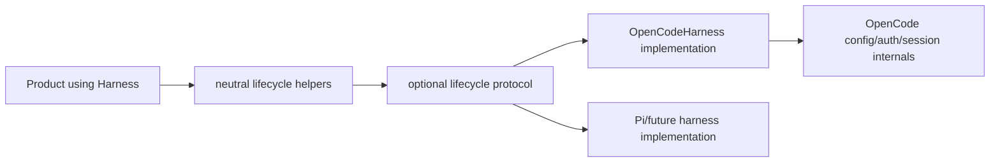

# Design Detail (agent-core): Neutral Harness Lifecycle For UTA Cleanup

Status: approved and scope-frozen by the requester on 2026-08-20. This is the
agent-core repo detail for the approved UTA architecture-boundary specification.
Agent-core changes are additive and must be released before the UTA consumer
removes concrete OpenCode calls.

## Changes In This Repo

Agent-core already owns neutral harness registration, turns, reusable sessions,
fallback, normalized results, progress, cancellation, per-turn workspaces, and
Git capabilities. UTA still imports OpenCode configuration, process, and auth
client APIs because neutral preparation, readiness, and bootstrap capabilities
are missing.

This repo will add those lifecycle capabilities to `agent_core.harness` and
implement them in `OpenCodeHarness`. It will not add Java/Python product
language or enforcement knowledge.

## Key Data Structures And Abstractions

`src/agent_core/harness/lifecycle.py` will define:

```python
class ReadinessStatus(str, Enum):
    READY = "ready"
    AUTHENTICATION_REQUIRED = "authentication_required"
    UNAVAILABLE = "unavailable"


@dataclass(frozen=True)
class HarnessReadiness:
    ready: bool
    status: ReadinessStatus
    detail: str = ""


@dataclass(frozen=True)
class WorkspaceBootstrapRequest:
    purpose: str
    timeout_seconds: int = 120
    prompt_file: Path | None = None


@runtime_checkable
class WorkspacePreparingHarness(Protocol):
    def prepare_workspace(self, *, repo_path: Path) -> None: ...


@runtime_checkable
class ReadinessCheckingHarness(Protocol):
    def check_readiness(
        self, *, repo_path: Path, timeout_seconds: int
    ) -> HarnessReadiness: ...


@runtime_checkable
class WorkspaceBootstrappingHarness(Protocol):
    def bootstrap_workspace(
        self, *, repo_path: Path, request: WorkspaceBootstrapRequest
    ) -> BootstrapResult: ...
```

Bootstrap returns a typed neutral result, not `Any`. `Any` would have made the
product parse whatever the adapter happened to return, which is the provider
coupling this API exists to remove:

```python
@dataclass(frozen=True)
class BootstrapResult:
    completed: bool
    session_id: str | None          # for correlating with turn records
    output_text: str                # what the harness produced, unparsed
    duration_seconds: float
    usage: TurnUsage | None = None  # the existing neutral usage record
```

`output_text` is deliberately unstructured: agent-core does not know what a
project summary is. UTA decides whether that text is worth keeping and where it
goes, which is the split the specification asks for — agent-core owns *how the
session ran*, the product owns *why and which artifacts matter*.

The public helpers are:

- `prepare_harness_workspace(harness, repo_path=...)`;
- `check_harness_readiness(harness, repo_path=..., timeout_seconds=...)`; and
- `bootstrap_harness_workspace(harness, repo_path=..., request=...)`.

Readiness metadata is finalized as follows. `HarnessSpec` gains one optional
field, `readiness: Literal["probe", "not_required"] | None = None`:

- `None` (the default, and what every existing construction produces) means the
  harness has not declared anything. `check_harness_readiness` then requires the
  `ReadinessCheckingHarness` protocol and raises `ReadinessUnsupportedError`
  without it. Absence is never read as success.
- `"not_required"` is an explicit declaration that the harness needs no external
  readiness — a local or offline harness — and returns `ready` without a probe.
- `"probe"` is the same as the protocol path and exists so a spec can state the
  requirement even when the harness object is constructed elsewhere; declaring
  `"probe"` on a harness without the protocol is a construction-time error, not
  a runtime surprise.

Preparation is optional and defaults to a no-op. Bootstrap is optional and
raises `BootstrapUnsupportedError` when called for an unsupported harness.
Paths are resolved and validated as directories before delegation; timeouts
must be positive and bounded by the product's request.

`HarnessReadiness.detail` is public-safe and bounded. Implementations keep raw
provider diagnostics in private logs with existing redaction.

## Data Dependency Flow



Neutral modules import no OpenCode implementation. The built-in harness package
continues registering OpenCode at its composition boundary.

## Key Process Flow (intra-repo)

### Preparation and readiness

1. Product creates a harness with `create_configured_harness(HarnessSpec)`.
2. `prepare_harness_workspace` validates the repo and calls the optional
   implementation. OpenCode generates/merges its configuration using existing
   config builders. It does not expose the config path or provider fields.
3. `check_harness_readiness` invokes the implementation probe under the
   caller's retry policy (below), bounded by the supplied timeout.
4. OpenCode performs its existing auth/model confirmation logic internally and
   maps outcomes to `ready`, `authentication_required`, or `unavailable`.
5. Rate limit, timeout, cancellation, provider auth, and generic failures are
   normalized; raw provider payloads are not returned.

### Bootstrap

1. Product decides whether project bootstrap is required and supplies a
   neutral purpose, timeout, and optional prompt.
2. The helper validates the request and invokes the selected harness.
3. OpenCode uses its implementation-owned initialization/session mechanism.
   A future harness may run an ordinary isolated turn.
4. The helper returns the normal implementation-neutral result. Product code
   remains responsible for deciding and harvesting product artifacts.
5. Session/process cleanup runs in `finally` and is idempotent.

## Key Control Flow

```text
prepare:
  invalid repo -> ValueError before implementation
  capability absent -> no-op
  capability present -> delegate once

readiness:
  invalid repo/timeout -> ValueError
  explicit not_required -> ready without a probe
  capability present -> probe
      ready / authentication_required -> return immediately
      unavailable -> retry per policy, then return the last outcome
  otherwise -> ReadinessUnsupportedError

bootstrap:
  invalid request -> ValueError
  capability absent -> BootstrapUnsupportedError
  capability present -> delegate once with guaranteed cleanup
```

Readiness does not run implicitly from `run_turn` or `open_session`; products
choose when startup probing is appropriate. This prevents a new provider call
per phase/turn.

## Readiness Retry Policy

The current UTA implementation is not a single probe.
`uta/app/cli.py::_probe_openai_auth_ready_with_retry` runs **three** attempts
with `time.sleep(3 * attempt)` between them, re-raising the last failure. The
first design draft budgeted one attempt, which would have been a silent change
to a retry budget the specification lists under both non-goals and "ask first".

The policy is preserved and made explicit rather than inherited:

```python
@dataclass(frozen=True)
class ReadinessRetryPolicy:
    attempts: int = 3
    backoff_seconds: Callable[[int], float] = lambda attempt: 3.0 * attempt


def check_harness_readiness(
    harness: Harness,
    *,
    repo_path: Path,
    timeout_seconds: int,
    retry: ReadinessRetryPolicy = ReadinessRetryPolicy(),
) -> HarnessReadiness: ...
```

What retries and what does not is the part worth stating, because retrying an
authentication failure is pointless and slow:

| Outcome | Retried? |
| --- | --- |
| `unavailable` from timeout, rate limit, transport, or provider 5xx | yes |
| `authentication_required` | no — returned immediately |
| `ready` | no |
| Validation error (bad path, non-positive timeout) | no — raised before any probe |

This narrows the current behaviour in one respect and the narrowing is
deliberate: today an auth failure returns `False` and is not retried, but a
`RuntimeError` from a rate limit *is* retried three times, and so is an
unexpected failure. Mapping those to `unavailable` keeps the retried set the
same. Worst-case startup cost is unchanged: 3 × 120 s probe + 3 s + 6 s = 369 s,
and it is the caller's `attempts=1` to reduce.

UTA passes the default policy, so its observable startup behaviour after
migration is the same three attempts with the same backoff. A parity test
asserts the attempt count and sleep sequence against the pre-migration
implementation.

## What The Product Keeps Deciding

Two behaviours around the current probe are UTA's, not agent-core's, and the
lifecycle API must not absorb them silently.

**Who gets probed.** `uta/app/cli.py:641-647` returns early unless the resolved
provider is `openai`; every other provider is never probed today. A neutral
`check_harness_readiness` called unconditionally would add a provider round-trip
and a new startup failure mode for every non-OpenAI deployment. The gate is
expressed through the metadata that already exists: a harness whose spec
declares `readiness="not_required"` returns `ready` without a probe, and UTA
sets that declaration from its own configuration rather than branching on a
provider name. Agent-core adds no provider knowledge to make this work.

**What an exhausted retry means.** Today `_ensure_model_auth` raises a
`RuntimeError` and the CLI aborts; no task starts against an unauthenticated
harness. `check_harness_readiness` returns the last outcome rather than raising,
because a library returning a status is more useful than one that decides. The
decision stays with UTA, and it is unchanged: `authentication_required` or a
retry-exhausted `unavailable` raises at the UTA call site and stops the run. A
test asserts the run aborts, so this cannot degrade into log-and-continue.


## API And Schema Changes (this repo)

The change is an additive Python API exported from `agent_core.harness`.
Existing `Harness`, `HarnessSpec`, `HarnessSession`, `OpenCodeHarness`, turn,
session, fallback, and config APIs remain source compatible.

No persistence/schema/config-file format changes are required. A small neutral
`readiness` declaration may be added to `HarnessSpec`; default behavior keeps
old harness construction unchanged and only affects an explicit readiness
helper call.

Concrete legacy exports such as `OpenCodeProcess`, `OpenCodeAuthClient`, and
`generate_opencode_config` remain for existing direct consumers during this
release. UTA stops using them; their broader deprecation is a separate change.

## Key Design Tradeoffs (repo-local)

- Lifecycle capabilities are optional protocols rather than new mandatory
  methods on `Harness`, preserving third-party harness compatibility.
- Readiness is explicit and never automatically attached to turns, avoiding
  extra paid/network work.
- Preparation defaults to no-op because many harnesses require no repo-local
  config. Readiness does not default to success unless the implementation
  explicitly declares it unnecessary.
- Bootstrap exposes a neutral purpose/request, not OpenCode `/init`. The
  concrete adapter owns how initialization is achieved; the product owns why
  and which artifacts matter.
- Provider diagnostics are normalized in agent-core. Re-parsing OpenCode error
  dictionaries in UTA was rejected because it duplicates adapter policy.

See `docs/decisions/ADR-001-neutral-harness-lifecycle.md`.

## Capacity, Reliability, And Security

- Preparation is one call per product run. OpenCode work is the current config
  generation/merge and repository-directory validation; no provider call.
- Readiness is at most `attempts` provider/auth probes per product startup,
  each bounded by the caller's timeout (UTA uses 120 seconds). It is not called
  per phase, class, fallback candidate, or recovery turn. See the retry policy
  below for the worst-case budget.
- Bootstrap runs only when product policy requests it and retains the existing
  timeout. No extra bootstrap retry is introduced.
- Helper dispatch is an in-process protocol check and one method call.
- Repo paths are resolved before use; implementation-created files retain
  current permission/path confinement rules.
- Public readiness detail is length-bounded and sanitized. Tokens, environment,
  config JSON, raw responses, commands, and provider stack traces remain
  private.
- Cleanup is idempotent and must not mask the primary error.

## Failure-Mode Handling

| Failure | Detection | Handling |
| --- | --- | --- |
| Third-party harness lacks optional protocol | runtime protocol check | no-op preparation; explicit readiness/bootstrap unsupported error |
| OpenCode config preparation fails | neutral preparation exception with sanitized message | product stops before paid work; private logs retain diagnosis |
| Authentication missing | `authentication_required` readiness | product presents existing auth flow/action; no task starts |
| Probe timeout/rate limit/provider outage | `unavailable` with normalized detail | product may stop/retry according to product policy; agent-core does not hide it as auth success |
| Bootstrap unsupported | `BootstrapUnsupportedError` | product skips only when its policy marks bootstrap optional |
| Session/process cleanup fails | private warning after idempotent cleanup attempt | does not replace primary result/error |

## Repo-Local Risks And Verification

Tests will cover:

- optional protocol detection and safe defaults;
- readiness declaration matrix: absent, `probe`, `not_required`, and
  `probe` declared without the protocol, including a harness declared
  `not_required` never issuing a probe;
- retry policy: three attempts with 3 s/6 s backoff by default, no retry on
  `authentication_required`, `attempts=1` honoured, and a sleep-sequence parity
  test against the current UTA implementation;
- typed `BootstrapResult` fields, including a harness that completes with no
  output text;
- invalid path/timeout/request validation;
- fake neutral harness lifecycle behavior;
- OpenCode configuration preparation using current builders;
- readiness mapping for success, auth failure, timeout, rate limit, provider
  error, and sanitized detail;
- bootstrap session isolation, prompt/no-prompt behavior, and cleanup;
- exactly one readiness call and no implicit call from turn/session paths;
- an alternate fake/Pi-style harness proving no product change is needed;
- old consumer imports and `HarnessSpec` construction; and
- public export/source-boundary checks proving lifecycle.py imports no concrete
  harness or product language.

Release verification:

```bash
python -m pytest tests -q
python -m compileall -q src/agent_core
python -m ruff check src tests
git diff --check
```

After tests pass, bump from the current development version, build and inspect
the wheel, push the main branch, verify the remote ref, and make UTA pin the
released version before consuming the API.

## Changelog

- 2026-08-20 — Initial agent-core detail generated for UTA architecture cleanup.
- 2026-08-21 — Design-review dispositions: typed `BootstrapResult` replaces
  `Any`, `HarnessSpec.readiness` metadata finalized, and the existing
  three-attempt readiness retry policy preserved explicitly.
