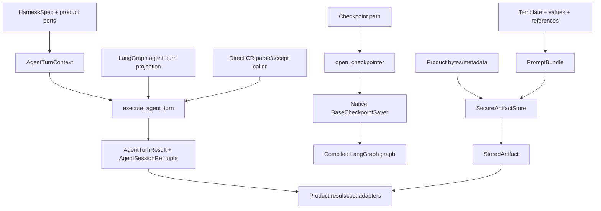

# Design Detail (agent-core): Workflow Persistence and Common Capabilities

## Status And Scope

- Status: approved by the user for planning on 2026-08-21
- Overview: `docs/design-workflow-persistence-and-common-capabilities.md`
- Approved spec: `docs/spec-workflow-persistence-and-common-capabilities.md`
- This document is authoritative for agent-core APIs and implementation ownership.

## Changes In This Repo

| Current module | Change |
| --- | --- |
| `agent_core.workflow.checkpoints` | Remove `WorkflowCheckpointer`; yield native saver; add capability-checked lineage deletion helper. |
| `agent_core.workflow.execution` | Preserve identity and four-state invocation; type against native saver/compiled graph only. |
| `agent_core.workflow.graph` | Accept the native saver unchanged and validate it through LangGraph compilation. |
| `agent_core.workflow.nodes` | Project graph state through the canonical typed turn executor; remove direct callback-key lookup. |
| `agent_core.harness.execution` | Add typed `execute_agent_turn` request/context/result without depending on workflow. |
| `agent_core.harness.node` | Retain `run_harness_node` as the only attempt/parse/accept loop; enrich records with refs. |
| `agent_core.harness.turn_result` | Move/own neutral `AgentTurnResult` and normalization so direct execution is workflow-free. |
| `agent_core.runtime.artifacts` | Evolve into secure atomic/verified/immutable artifact storage. |
| `agent_core.prompts` | Add prompt references, manifests, and immutable bundle materialization. |
| `agent_core.harness.sessions` | Own `AgentSessionRef`, locator scope, per-attempt session projection, and fallback aggregation. |
| `agent_core.harness.diagnostics` | Add diagnostics protocol/closed DTO union/limits. |
| OpenCode harness adapter | Produce session refs and implement bounded offline diagnostics. |
| `agent_core.git.publish` | Preserve scoped publisher; add isolated publication coordinator and result. |
| `agent_core.integrations.gitlab` | Implement neutral MR publisher protocol and manual URL generation. |
| Public exports/README | Export and document the 0.7 breaking contract and ownership boundary. |

No agent-core database schema changes are introduced.

## Key Data Structures And Abstractions

### Checkpoint API

```python
class CheckpointCapabilityError(RuntimeError): ...

@contextmanager
def open_checkpointer(
    path: str | Path, *, forbidden_roots: Sequence[Path]
) -> Iterator[BaseCheckpointSaver]: ...

def delete_checkpoint_lineage(
    saver: BaseCheckpointSaver,
    identity: WorkflowRunIdentity,
) -> None: ...
```

`open_checkpointer` also requires `forbidden_roots`; it applies the secure-root
validator before creation, rejects ancestor/descendant overlap and symlinked
ancestors, and never chmods an existing broad/shared parent. The optional
LangGraph import remains lazy. `BaseCheckpointSaver` is used for
typing only inside the optional workflow module. Package import without the
`langgraph` extra remains supported.

`open_checkpointer` creates and configures the current SQLite saver internally.
Backend selection is not exposed in this iteration; tests inject a saver factory
through a private seam. Products receive the native saver and do not know its
concrete class.

`delete_checkpoint_lineage` verifies the public capability and maps an inherited
base `NotImplementedError` to `CheckpointCapabilityError`; a callable stub is not
treated as support. The tested dependency bounds are `langgraph>=1.0,<2.0` and
`langgraph-checkpoint-sqlite>=2.0,<4.0`.

### Canonical agent-turn executor and ports

Protocols and ordering:

| Port | Required when | Methods | Failure authority |
| --- | --- | --- | --- |
| `CancellationSource` | optional | `is_cancelled()` | Cancellation before a call prevents paid work; during a call delegates to harness. |
| `SessionFactory` | `session_scope=phase` | `open_session(...)` | Failure aborts before the turn. |
| `TurnGuard` | optional | `before(...)`, `after(...)` | Authoritative; rejection prevents result durability. |
| `TurnProgressPort` | optional | `callback(...)`, `flush()` | Best-effort/no-throw; returns diagnostics only. |
| `TurnCostPort` | every harness; no-cap uses no-op admission plus recording | `before_paid_attempt(...)`, `after_paid_attempt(..., TurnCost)` | Called for every provider submission across retry/fallback/recovery; failure prevents the next paid call. |
| `TurnResultPort` | durable normalized/direct mode | `commit(AgentTurnRequest, AgentTurnExecutionResult)`, `reject(request, result, reason)` | Authoritative; the request carries operation identity even for pre-guard cancellation, commit failure prevents node checkpoint, and reject may persist audit but never an accepted/reusable product result. |
| `AttemptRecorder` | optional | existing recorder lifecycle | Recording failures follow existing `run_harness_node` policy. |
| `ExecutionObserver` | optional | `check_before_attempt(...)` | Check failure prevents the next paid attempt. Product background heartbeat remains outside the turn. |

`HarnessBinding(name, harness)` preserves the configured neutral name; attribution
is never inferred from a class. `AgentTurnContext.validate(request)` checks these
conditions before execution.
It copies no live port into graph state; the context remains application-owned.

Execution order remains:

1. validate typed context and node configuration;
2. check cancellation;
3. open session when requested;
4. run before-guard;
5. observer pre-attempt check, then execute attempts through `run_harness_node`;
   immediately around every actual provider submission, the harness invokes the
   cost port with one monotonic paid-attempt ordinal, including fallback and
   recovery candidates;
6. parse/accept/retry as today; no later paid attempt starts until the prior
   `after_paid_attempt` succeeds;
7. snapshot and normalize result;
8. run after-guard while capturing (not swallowing) rejection;
9. flush progress;
10. close session;
11. on guard success call result-port `commit`; on guard rejection call
    result-port `reject` with the same execution result, then re-raise rejection;
12. return JSON-safe state update only after successful commit.

`execute_agent_turn(request, context)` owns this order. LangGraph `agent_turn`
only projects state/config; CR direct nodes invoke the same function with their
existing parse/accept callbacks. It returns `AgentTurnExecutionResult` containing
both the exact `NodeOutcome` and normalized `AgentTurnResult`; direct callers use
the former, LangGraph projects the latter. Cancellation records a cancelled
result when a result port exists. Accepted, failed, skipped, and unreachable
terminal outcomes call `commit` after guard acceptance/flush/session close. Guard
rejection calls `reject` so a product can persist attempt/session audit without
marking a reusable result. Existing exception ordering is preserved;
this iteration does not close the acknowledged host-kill cost gap.

The cost port is per paid attempt, not per outer operation. One ordinal generator
is shared by `run_harness_node`, `FallbackHarnessSession`, and recovery calls.
Every adapter reports `TurnCost.unavailable` even when its call raises after
submission. A two-attempt cap fixture proves attempt one can consume the remaining
budget and block attempt two. With an active monetary cap, an unknown charge also
blocks the next retry/fallback admission; with no cap, bounded fallback may
continue but its aggregate remains unavailable.

`TurnResult` and `TurnRecord` gain ordered `session_refs`. A concrete session adds
its current ref before returning. `FallbackHarnessSession` accumulates each
candidate result/snapshot and returns the final outcome with the ordered,
de-duplicated union; recovery merges into the same tuple. `describe_turn` copies
that tuple before recorder finish, while the later session snapshot independently
checks the normalized aggregate. A mismatch is a typed execution error and no
accepted result is committed.

### Secure artifact API

`SecureArtifactStore` constructor:

```python
SecureArtifactStore(
    root: Path,
    *,
    directory_mode: int = 0o700,
    file_mode: int = 0o600,
    forbidden_roots: Sequence[Path] = (),
)
```

Path components use a conservative relative-path validator. Nested directories
are allowed, but `.`/`..`, absolute paths, NUL, empty components, backslash
ambiguity, option-like leading `-`, and symlinks are rejected. The store opens
files with `O_NOFOLLOW` where available and always performs lstat-style checks.

There is one lock level only: a fixed 256-slot striped namespace lock set.
`.locks` is a reserved caller-forbidden top-level name. Owner-only files
`<store-root>/.locks/00.lock` through `ff.lock` are created/validated at store
open; the first raw byte of `SHA-256(relative_namespace UTF-8)` selects a slot.
Each write, verified read,
manifest commit, or deletion opens that file with `O_NOFOLLOW`, validates
mode/type, and takes an exclusive advisory OS lock. Hash collisions serialize
unrelated local operations but do not affect correctness. No destination lock
exists, inode count is bounded, and process death releases the advisory lock.

An immutable writer under the lock verifies existing bytes or writes
`<destination>.<uuid>.partial`, fsyncs, renames, chmods, and fsyncs the parent.
Reads and immutable comparisons require `max_bytes`. `write_bytes` joins the text
and JSON APIs. Deletion attempts the same namespace lock non-blocking and refuses
when another process holds it. Once held, exact-name regular partial files are
crash residue and may be removed; symlink, malformed partial, or layout mismatch
fails closed. `NamespaceLayout` governs all remaining entries.
Mutable writes use atomic replacement. `write_text(max_bytes=...)` truncates on a Unicode code-point boundary and
sets `truncated`; immutable workflow evidence uses rejection rather than
truncation.

### Prompt bundles

`PromptLibrary.render_bundle` takes a template, values, bundle directory,
references, strict metadata options, and fixed filenames. References are copied
to immutable tuples at construction. The manifest schema is version 1:

```json
{
  "schema_version": 1,
  "files": [
    {"path": "prompt.md", "media_type": "text/markdown", "bytes": 123, "sha256": "..."},
    {"path": "inputs.json", "media_type": "application/json", "bytes": 45, "sha256": "..."}
  ]
}
```

Files are sorted by relative path. The manifest excludes itself. Under the
namespace lock, final files are atomically written and verified before
`manifest.json` is atomically written last. The manifest is the only completion
marker. A crash before it is incomplete and rematerializable; conflicting
complete bytes fail. This preserves CR's existing mixed output directory.

### Session diagnostics

`AgentSessionRef` validates only neutral name/locator syntax and locator scope
(`durable` or `process`); it never consults the live registry during durable-data
construction. It serializes as
`{"harness":"opencode","locator":"...","scope":"durable"}`.
Opaque IDs are never used directly as artifact filenames; existing
`opaque_artifact_id` remains the path projection.

`DiagnosticsLimits` has the exact fields/defaults in the overview. Callers may
lower but never exceed hard maxima. `SessionDiagnosticsReport.items` is the closed
available/unsupported/unavailable union. `total_usage` is present only when every
requested item is available; model usage is a sorted tuple. Input-limit excess is
always `DiagnosticsLimitExceeded`, never a report item.

OpenCode keeps its wrapper UUID process-scoped and exposes the native
`_SessionState.opencode_session_id` from an adapter-private snapshot accessor once
learned. Fallback snapshots merge all ordered/deduplicated candidate refs. A
process-restart test exercises the durable native locator. Diagnostics uses a
read-only SQLite URI and `PRAGMA query_only=ON`. It validates schema, binds IDs,
then runs one aggregate query over count/max/sum of `length(data)` before fetching
payload. Only within bounds does a second ordered query stream and parse rows. A
row above 1 MiB or total above 64 MiB fails without payload fetch or partial
totals. Schema mismatch returns a
typed unavailable result, not a raw SQLite error. The implementation does not
write or migrate OpenCode's database.

Optional collectors are registered beside their harness adapters and resolved
with `create_configured_diagnostics_provider(HarnessSpec, **opaque_options)`.
Products therefore select diagnostics through the same neutral name as turn
execution and receive `None` when that harness has no offline capability; they
never import a concrete collector. Database-path overrides used during a
compatibility window remain opaque adapter options.

### Publication

`PublicationCoordinator` depends on:

- `GitWorkspace` for clone/checkout;
- `GitScopedPublisher` for commit/rebase/push/verification;
- optional `MergeRequestPublisher` for forge integration;
- injected clock/temp-root for deterministic tests.

`GitPublishRequest` carries separate `base_branch` and `publish_branch`. An absent
publish branch starts at the fetched base; an existing branch is updated. The
mutation callback runs once. Stable publication identity yields a stable branch.
If that remote branch verifies the same publication marker/content and mutation
has no new approved diff, Git returns `REUSED_PUBLISHED`; the coordinator skips
commit/push and continues MR ensure.
`ensure_merge_request` queries first, creates once, and queries again after an
ambiguous failure. Outcomes are `CREATED`, `EXISTING`, `MANUAL`, and `FAILED`.
The coordinator never deletes a pushed remote branch.

## Data Dependency Flow



## Key Process Flow (intra-repo)

### Checkpoint open/invoke/delete

```text
validate lexical path
  -> create/chmod parent
  -> create native LangGraph saver
  -> setup saver
  -> chmod/verify DB
  -> yield saver
       -> graph.compile(checkpointer=saver)
       -> invoke_workflow(...)
       -> optional delete_checkpoint_lineage(saver, identity)
  -> close native saver
```

### Agent turn

```text
node config + AgentTurnContext
  -> validate required ports
  -> cancellation/cost/session/guard
  -> run_harness_node
  -> snapshot + normalize
  -> cost record
  -> guard acceptance + progress flush + close
  -> result record
  -> JSON-safe state update
```

## Key Control Flow

### Checkpoint classification

`invoke_workflow` retains exactly four branches:

- absent: invoke initial mapping;
- pending: invoke `None`;
- completed: return snapshot values;
- corrupt/unreadable: raise `WorkflowCheckpointError`.

No exception from `get_state` is interpreted as absence.

### Artifact conflict

- no destination: write atomically;
- destination with identical bytes: reuse;
- destination with different bytes: `ArtifactConflictError`;
- unexpected permissions/symlink/type: `ArtifactSecurityError`;
- size above reject limit: `ArtifactTooLarge` before trusted finalization.

### Diagnostics

- provider supports capability and schema: stream and aggregate;
- provider lacks capability: an `UnsupportedSessionDiagnostics` item;
- adapter storage/schema unavailable: sanitized unavailable result;
- hard count/raw-row/raw-total bound exceeded: `DiagnosticsLimitExceeded`, fail
  without a report or partial totals;
- output detail bound exceeded after exact totals: truncate details visibly.

### Publication

- no changed paths with a verified matching stable remote publication:
  `REUSED_PUBLISHED`, continue MR ensure;
- no changed paths without a matching prior publication: `NO_CHANGES`, no MR;
- unexpected dirty path: `PushPolicyError` before commit;
- push conflict/failure/SHA mismatch: fail, no MR request;
- push success + no MR request: complete;
- push success + MR URL: complete;
- push success + missing credentials: manual status/URL;
- push success + MR API error: failed status/manual URL.

## API And Schema Changes

### Public additions

- `delete_checkpoint_lineage`
- `CheckpointCapabilityError`
- `HarnessBinding`, `AgentTurnRequest`, `AgentTurnContext`,
  `execute_agent_turn`, and their port protocols
- `AgentTurnExecutionResult`; plural `TurnRecord.session_refs`
- `SecureArtifactStore`, `StoredArtifact`, artifact errors
- `AgentSessionRef`, diagnostics DTOs/protocol/errors/limits
- neutral diagnostics-provider registration and configured construction
- `PromptReference`, `PromptBundle`, `render_bundle`
- `PublicationCoordinator`, request/result, `MergeRequestPublisher`
- `GitPublicationOutcome` and its pushed/reused/no-change variants

### Public transitions

- `open_checkpointer` still exists but yields the native saver rather than
  `WorkflowCheckpointer`.
- `WorkflowCheckpointer`, mapping-based turn context, old artifact return shape,
  singular result session projection, and the old always-pushed
  `GitPublishResult` result shape are breaking removals in 0.7.0.
- Consumers remain pinned to 0.6.11 until their matching 0.7 migration is ready;
  no old-consumer/new-core combination is supported.

No persisted agent-core schema changes.

## Key Design Tradeoffs

- Native saver plus helper is smaller and safer than subclass forwarding.
- One frozen context is more explicit than callback keys while small protocols
  avoid a god service.
- SecureArtifactStore extends the existing store name/role instead of introducing
  a parallel package.
- Diagnostics are optional harness capability, not methods on every harness.
- Prompt bundles use locked manifest-last completion so mixed output directories
  remain compatible and readers never accept partial content.
- Publication reports partial success rather than attempting unsafe remote rollback.

## Capacity, Reliability, And Security

- Checkpoint operations retain one open, setup, state read, and close per current
  application lifecycle; wrapper removal adds no I/O.
- Artifact locks never span model, Git, network, or product DB work.
- Prompt bundle file count is capped at 256 references and total bytes at the
  caller's configured product limit; the core hard ceiling is 64 MiB per bundle.
- Diagnostics hard limits are 32 sessions, 200,000 parts, 5,000 steps, 200
  signals, 1 MiB per raw row, 64 MiB total raw input, and 1 MiB output.
- Publication has one mutation per invocation, one scoped Git publication
  sequence when not reused, one MR lookup, at most one create request, and one
  ambiguity lookup.
- All filesystem and diagnostic errors are sanitized at public boundaries.
- No raw prompt, reasoning, command, or provider DB row appears in progress or
  exception messages.

## Failure-Mode Handling

| Failure | Response |
| --- | --- |
| Optional LangGraph extra missing | `ImportError` before opening workflow resources. |
| Checkpoint permission drift | Refuse open or next managed operation. |
| Saver deletion absent or inherited `NotImplementedError` | Leave lineage intact and raise capability error. |
| Typed context missing required capability | Fail validation before paid work. |
| Progress projection/sink failure | Latch sanitized diagnostic; never raise into turn. |
| Cost/result authoritative port failure | Raise and prevent node checkpoint according to existing ordering. |
| Artifact disk/permission/hash failure | No trusted result; explicit artifact exception. |
| OpenCode DB schema drift | Diagnostics unavailable, task execution unaffected. |
| Publication MR failure after push | Return pushed/failed result with manual URL. |

## Repo-Local Risks And Verification

### Risks

1. Native saver return-type change may break an unknown consumer calling
   `.delete(identity)`. Mitigation: release notes, source search, and a clear
   replacement helper; no known external type import exists.
2. Typed context ordering drift could change guard/cost/result semantics.
   Mitigation: freeze an ordered call trace for success, failure, cancellation,
   session close, and progress failure.
3. Stronger artifact permissions may reject pre-existing unsafe roots.
   Mitigation: fail with the exact path and provide an operator permission repair
   command; never silently chmod an existing broad root except the exact managed
   path already owned by the application.
4. Offline OpenCode schema changes. Mitigation: introspection and typed unavailable
   result rather than best-effort wrong totals.

### Verification

- Existing checkpoint and workflow execution suites run against real LangGraph.
- New test asserts `open_checkpointer` yields the concrete saver and no
  `WorkflowCheckpointer` symbol/forwarders remain.
- Fake saver verifies deletion capability error without private SQL.
- Property/fault tests cover path components, symlinks, conflict, truncation,
  fsync/rename failure, and exact deletion.
- Subprocess tests kill a writer while holding the namespace lock and after a
  partial write; the OS lock releases, recognized residue is recoverable, active
  holders block deletion, malformed residue remains fail-closed, `.locks` is
  caller-forbidden, and creating arbitrarily many namespaces leaves exactly 256
  lock files.
- Golden manifests cover Unicode prompt/reference bytes and stable order.
- Diagnostics fixtures cover zero, missing, schema drift, multi-session aggregate,
  mixed available/unavailable (no report-level partial aggregate), hard limit,
  output truncation, and sanitization.
- Publication fixtures cover all status branches and exact Git call counts.
- OpenCode fixtures cover wrapper/native locator separation, every fallback
  candidate ref, and offline diagnostics after process restart.

## Changelog

- 2026-08-20 — Initial agent-core detail generated from the approved spec.
- 2026-08-20 — Revision 2 integrates all independent-review corrections and the
  coordinated 0.7 breaking release.
- 2026-08-20 — Revision 3 passed fourth independent design review.
