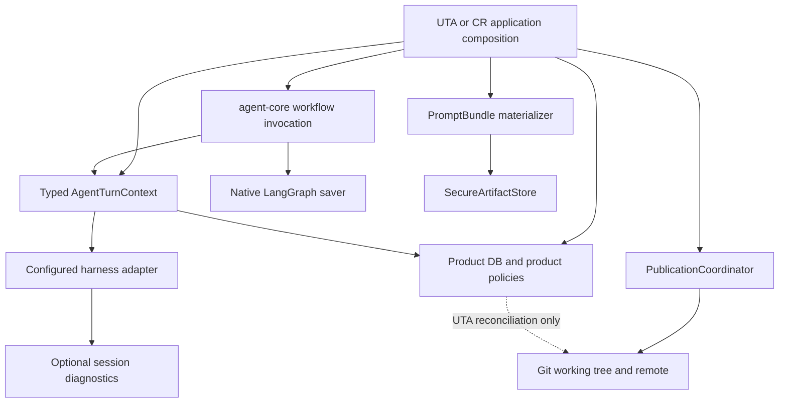
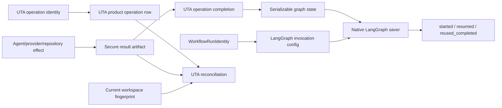
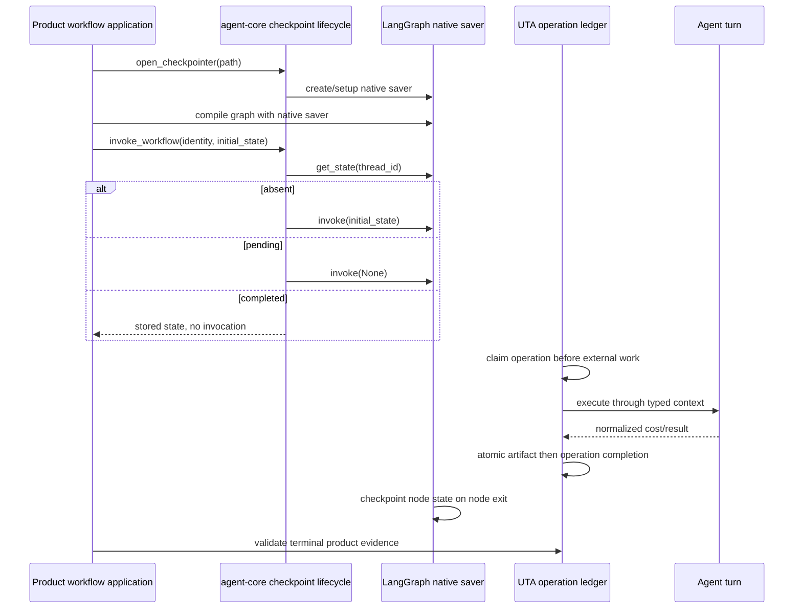
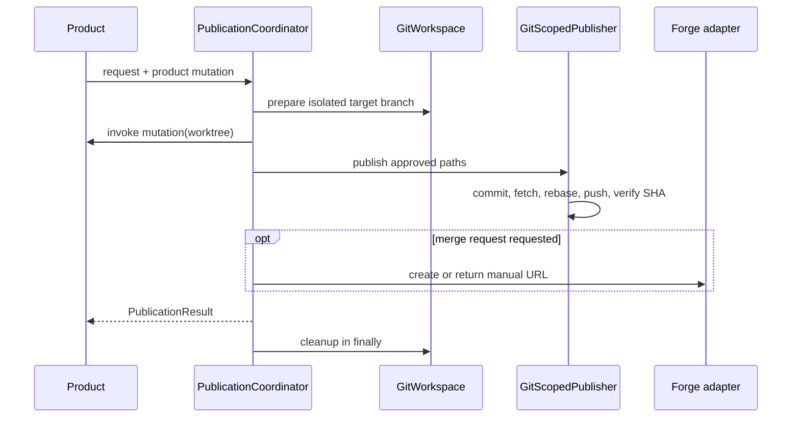

# Design Overview: Workflow Persistence Simplification and Common Capabilities

## Status And Traceability

- Status: approved by the user for planning on 2026-08-21
- Approved source: `docs/spec-workflow-persistence-and-common-capabilities.md`
- Work type: non-Jira multi-repository tooling iteration
- Affected repositories: `agent-core`, `unit-test-agent`, `cr_plugin`
- Detail designs:
  - `docs/design-workflow-persistence-and-common-capabilities-agent-core.md`
  - `unit-test-agent/docs/design-workflow-persistence-and-common-capabilities.md`
  - `cr_plugin/docs/design-workflow-persistence-and-common-capabilities.md`
- Usage design: `docs/usage-workflow-persistence-and-common-capabilities.md`
- ADRs:
  - `docs/decisions/ADR-002-native-langgraph-checkpoints-and-product-evidence.md`
  - `docs/decisions/ADR-003-typed-agent-turn-execution-context.md`
  - `docs/decisions/ADR-004-centralize-secure-mechanics-not-product-policy.md`

## Contents

1. [Goals And Non-Goals](#goals-and-non-goals)
2. [High-Level Design](#high-level-design)
3. [Intra-System Relationships And Cooperation](#intra-system-relationships-and-cooperation)
4. [Canonical Contracts](#canonical-contracts)
5. [Data Dependency Flow](#data-dependency-flow)
6. [Key Process Flows](#key-process-flows)
7. [Key Design Tradeoffs](#key-design-tradeoffs)
8. [Capacity, Reliability, And Security](#capacity-reliability-and-security)
9. [Failure-Mode Handling](#failure-mode-handling)
10. [Rollout Plan And Strategy](#rollout-plan-and-strategy)
11. [Verification Plan](#verification-plan)
12. [First-Principles Check](#first-principles-check)

## Goals And Non-Goals

### Goals

1. Compile durable graphs with LangGraph's native saver object, without an
   agent-core subclass that mirrors the saver interface.
2. Preserve agent-core's stable lineage identity, secure file lifecycle, exact
   start/resume/reuse semantics, and safe deletion API.
3. Make the boundary between graph state and product side effects explicit and
   testable.
4. Replace duplicated private-file mechanics with one secure artifact store.
5. Replace magic callback keys around `agent_turn` with a typed, immutable
   execution context.
6. Make session identity and diagnostics harness-neutral at product boundaries.
7. Materialize prompts, inputs, references, and their manifest as one secure
   reproducible bundle.
8. Compose isolated Git publication and optional merge-request creation once in
   agent-core.
9. Migrate UTA and CR without changing their business behavior, checkpoint
   identity, prompt bytes, enforcement boundary, or product source of truth.

### Non-Goals

- Replacing LangGraph, its SQLite saver, or its serialization format.
- Making repository edits, filesystem writes, provider charges, and product DB
  transactions atomic with a graph checkpoint.
- Moving UTA's `WorkflowOperationLedger`, crash classifications, generation
  phases, enforcement, or task schema into agent-core.
- Moving CR reviewer selection, findings, feedback, retrospective policy, or task
  schema into agent-core.
- Generalizing UTA's enforcement command runner into agent-core.
- Dropping existing public response aliases or physical legacy columns in this
  iteration.
- Adding a network service, new queue, or new database.

## High-Level Design

The iteration narrows agent-core around six reusable capabilities. Products
compose these capabilities with their own persistence and policy ports.



The native LangGraph saver remains the only graph-checkpoint implementation.
`open_checkpointer(path)` continues to be the resource-owning context manager,
but it yields the native saver. Lineage deletion becomes the separate
`delete_checkpoint_lineage(saver, identity)` helper. `WorkflowRunIdentity` and
`invoke_workflow` remain stable.

The generic artifact store becomes the foundation for prompt bundles and UTA
operation result bytes. Product-specific identity and deletion eligibility remain
outside the store.

## Intra-System Relationships And Cooperation

### Ownership

| Concern | Owner | Consumer responsibility |
| --- | --- | --- |
| Graph state, next node, interrupt persistence | LangGraph saver | Supply serializable state and stable thread identity. |
| Saver path security and resource lifetime | agent-core workflow | Supply an application-state path outside target repositories. |
| Start/resume/completed-reuse classification | agent-core workflow | Record disposition and choose clean-rerun identity explicitly. |
| Repository/product side-effect reconciliation | UTA testgen | Supply fingerprints, operation rows, retry policy, and terminal validation. |
| Private artifact mechanics | agent-core runtime | Supply namespace, content, byte limits, and forbidden roots. |
| Artifact meaning and retention eligibility | UTA or CR | Select identities and deletion order. |
| Agent-turn lifecycle | agent-core workflow/harness | Supply typed product adapters for cost, result, progress, and guards. |
| Session diagnostics | agent-core harness adapter | Decide whether/how to expose sanitized diagnostics. |
| Prompt templates and values | UTA or CR | Own domain content and golden bytes. |
| Git mechanics and optional forge interaction | agent-core Git/integrations | Own paths, branches, messages, project, and credentials. |

### Dependency direction

```text
UTA app ─────┐
             ├─> UTA testgen policy ─> agent-core public capabilities ─> LangGraph/Git/harness
UTA tasks ───┘             │
                           └─> UTA operation and task persistence

CR app ─────────> CR review policy ──> agent-core public capabilities ─> LangGraph/Git/harness
                                  └──> CR task persistence

tools/python-enforcement ──> uta_enforce_core ──> language enforcement bindings
                           (no agent-core dependency)
```

Agent-core never imports UTA or CR. Product task persistence never becomes an
agent-core port implementation implicitly; composition is performed in the app
or workflow application layer.

## Canonical Contracts

### Native checkpoint lifecycle

```python
class WorkflowDisposition(Enum):
    STARTED = "started"
    RESUMED = "resumed"
    REUSED_COMPLETED = "reused_completed"

@contextmanager
def open_checkpointer(
    path: Path, *, forbidden_roots: Sequence[Path]
) -> Iterator[BaseCheckpointSaver]: ...

def delete_checkpoint_lineage(
    saver: BaseCheckpointSaver,
    identity: WorkflowRunIdentity,
) -> None: ...
```

`open_checkpointer` validates the lexical path before creation, creates the
parent as `0700`, opens the configured LangGraph saver, runs its setup, makes the
database `0600`, verifies it again, and closes it on context exit. The function
does not wrap, subclass, or forward saver methods.

`delete_checkpoint_lineage` calls the saver's public `delete_thread` capability.
If unavailable, it raises `CheckpointCapabilityError`; it never writes private
checkpoint tables. `build_graph(..., checkpointer=saver)` receives exactly the
native object yielded by the context manager.

`WorkflowRunIdentity` and `invoke_workflow` retain their current public fields,
three successful dispositions, and separate corruption error. No checkpoint
identity changes.

### Canonical typed turn execution

```python
@dataclass(frozen=True)
class HarnessBinding:
    name: str
    harness: Harness

@runtime_checkable
class ExecutionObserver(Protocol):
    def check_before_attempt(self, *, operation_id: str, attempt: int) -> None: ...

@dataclass(frozen=True)
class AgentTurnRequest:
    name: str
    repo_path: Path
    prompt: Callable[[int, str | None], Path]
    operation_id: str
    attempts: int = 1
    parse: Callable[[str], Mapping[str, JsonValue]] | None = None
    accept: Callable[[Any, Mapping[str, JsonValue]], str | None] | None = None
    on_failure: TurnFailurePolicy = TurnFailurePolicy.FAIL
    retryable: Callable[[BaseException], bool] | None = None
    recovery_prompt: Callable[[Any, str | None], Path] | None = None
    model_id: str | None = None
    timeout_seconds: float | None = None
    session_scope: SessionScope = SessionScope.NONE

@dataclass(frozen=True)
class AgentTurnExecutionResult:
    outcome: NodeOutcome
    normalized: AgentTurnResult

    # Stable conveniences delegated from outcome for direct callers.
    @property
    def accepted(self) -> bool: ...
    @property
    def payload(self) -> Mapping[str, JsonValue]: ...
    @property
    def record(self) -> TurnRecord | None: ...
    @property
    def attempts(self) -> int: ...
    @property
    def error(self) -> str | None: ...

@runtime_checkable
class TurnResultPort(Protocol):
    def commit(
        self, request: AgentTurnRequest, result: AgentTurnExecutionResult
    ) -> None: ...
    def reject(
        self, request: AgentTurnRequest, result: AgentTurnExecutionResult, *, reason: str
    ) -> None: ...

@runtime_checkable
class TurnCostPort(Protocol):
    def before_paid_attempt(
        self, *, operation_id: str, paid_attempt_ordinal: int, model_id: str | None
    ) -> None: ...
    def after_paid_attempt(
        self, *, operation_id: str, paid_attempt_ordinal: int, cost: TurnCost
    ) -> None: ...

@dataclass(frozen=True)
class AgentTurnContext:
    binding: HarnessBinding
    cost: TurnCostPort
    cancellation: CancellationSource | None = None
    sessions: SessionFactory | None = None
    guard: TurnGuard | None = None
    progress: TurnProgressPort | None = None
    results: TurnResultPort | None = None
    attempts: AttemptRecorder | None = None
    observer: ExecutionObserver | None = None

def execute_agent_turn(
    request: AgentTurnRequest,
    context: AgentTurnContext,
) -> AgentTurnExecutionResult: ...
```

`execute_agent_turn` is the sole lifecycle implementation and delegates the
attempt/parse/accept/recovery loop to `run_harness_node`. LangGraph `agent_turn`
only projects graph state/config into the typed request and back into JSON-safe
state. CR reviewer, judge, feedback, and retrospective nodes call the same
function directly, preserving their domain parsers and acceptance predicates.
`ExecutionObserver.check_before_attempt()` can fail before paid work;
product daemon heartbeats remain independent background work and silent stalls
are bounded by harness timeout/cancellation. No live port enters graph state.
Direct callers consume `outcome`/the convenience properties; the LangGraph
adapter projects only `normalized`. Cancellation before execution produces a
cancelled outcome/result and records it when an operation result port is present.
Every completed attempt loop—accepted, failed, skipped, or unreachable—produces
and records a normalized terminal result after guard acceptance, progress flush,
and session close through `TurnResultPort.commit`, together with the immutable
request carrying the operation identity. A guard rejection calls
`TurnResultPort.reject`: products may durably flush attempt/session audit but must
not mark the operation result accepted or reusable (provider cost remains
recorded). The port receives the entire execution result, including every session
ref. UTA keeps its result-artifact/operation policy.
The coordinated 0.7 release removes callback-map compatibility.

`TurnRecord` gains `session_refs: tuple[AgentSessionRef, ...]`. Recorder `start`
remains before provider submission and may durably create a product row/event.
Every harness result carries the ordered candidate refs used by that call;
`describe_turn` copies them before `recorder.finish`. Terminal attempt
status/usage/refs therefore share the existing finish transaction without
buffering STARTED evidence or holding a DB transaction across model work.

Cost admission is per provider submission, not per operation. The executor owns a
single monotonic `paid_attempt_ordinal` across node retry, provider fallback, and
recovery. The mandatory harness call contract invokes `before_paid_attempt`
immediately before each provider submission and `after_paid_attempt` immediately
after every return or exception (`TurnCost.unavailable` on unknown/exception),
before another candidate or retry may start. A rejected admission stops the loop.
All registered 0.7 harness adapters must implement this hook; a no-cap product may
inject a recorder-only/no-op admission policy, but cannot bypass after-attempt
reporting.

Policy after an unknown charge is explicit. When a product currency cap is active,
`after_paid_attempt(TurnCost.unavailable)` makes the next admission—including the
next fallback candidate—fail closed until an operator reconciles cost or removes
the cap. When no currency cap is configured, admission may continue through the
bounded fallback chain, but the aggregate cost remains unavailable if any attempt
is unknown. This is an intentional cap-safety rule, not a fallback regression.

### Secure artifact storage

```python
@dataclass(frozen=True)
class StoredArtifact:
    relative_path: str
    sha256: str
    bytes: int
    truncated: bool = False

@dataclass(frozen=True)
class IndexedFileRule:
    prefix: str
    suffix: str
    minimum: int
    maximum: int

@dataclass(frozen=True)
class NamespaceLayout:
    required_files: frozenset[str]
    optional_files: frozenset[str]
    allowed_directories: frozenset[str]
    indexed_files: tuple[IndexedFileRule, ...] = ()

class SecureArtifactStore:
    def write_bytes(..., immutable: bool = False) -> StoredArtifact: ...
    def write_text(..., immutable: bool = False) -> StoredArtifact: ...
    def write_json(..., immutable: bool = False) -> StoredArtifact: ...
    def read_verified(..., sha256: str, max_bytes: int) -> bytes: ...
    def delete_namespace(..., layout: NamespaceLayout) -> int: ...
```

All writes are atomic and private by default. A fixed 256-slot striped namespace
lock set under reserved `.locks` serializes write, verify, and delete operations
without per-namespace inode growth. Immutable comparison is bounded by `max_bytes`,
accepts identical bytes, and rejects conflicts. Deletion uses an exact typed
layout and refuses active locks, partial files, symlinks, and unknown entries.
Text truncation preserves valid UTF-8. JSON uses stable key order,
`ensure_ascii=False`, and `allow_nan=False`.

The store validates every existing path component without following symlinks,
resolves containment against its root, and optionally rejects overlap with
caller-supplied `forbidden_roots`, including the target source repository.
Deletion requires a validated namespace plus a frozen exact `NamespaceLayout`.

### Session identity and diagnostics

```python
@dataclass(frozen=True)
class AgentSessionRef:
    harness: str
    locator: str
    scope: SessionLocatorScope  # DURABLE or PROCESS

class DiagnosticSignalCategory(Enum):
    HINT = "hint"
    COMPILE_FACT = "compile_fact"
    REPEATED_TOOL = "repeated_tool"
    OBSERVATION = "observation"

class DiagnosticsStatus(Enum):
    AVAILABLE = "available"
    UNSUPPORTED = "unsupported"
    UNAVAILABLE = "unavailable"

class DiagnosticsReasonCode(Enum):
    HARNESS_UNSUPPORTED = "harness_unsupported"
    PROCESS_SCOPED_LOCATOR = "process_scoped_locator"
    STORAGE_UNAVAILABLE = "storage_unavailable"
    SCHEMA_UNAVAILABLE = "schema_unavailable"
    LOCATOR_NOT_FOUND = "locator_not_found"

class SessionStepKind(Enum):
    MODEL = "model"
    TOOL = "tool"
    PATCH = "patch"

@dataclass(frozen=True)
class DiagnosticSignal:
    category: DiagnosticSignalCategory
    code: str
    count: int
    tool_name: str | None
    private_summary: str | None

@dataclass(frozen=True)
class TokenUsage:
    input_tokens: int
    output_tokens: int
    cache_read_tokens: int
    cache_write_tokens: int
    reasoning_tokens: int
    total_tokens: int

@dataclass(frozen=True)
class ModelUsage:
    model: str
    usage: TokenUsage

@dataclass(frozen=True)
class SessionStepDiagnostic:
    sequence: int
    kind: SessionStepKind
    duration_seconds: float | None
    tool_name: str | None

@dataclass(frozen=True)
class AvailableSessionDiagnostics:
    status: Literal[DiagnosticsStatus.AVAILABLE]
    session: AgentSessionRef
    usage: TokenUsage
    usage_by_model: tuple[ModelUsage, ...]
    duration_seconds: float | None
    tool_calls: int | None
    patch_count: int | None
    steps: tuple[SessionStepDiagnostic, ...]
    signals: tuple[DiagnosticSignal, ...]
    truncated: bool

@dataclass(frozen=True)
class UnsupportedSessionDiagnostics:
    status: Literal[DiagnosticsStatus.UNSUPPORTED]
    session: AgentSessionRef
    reason_code: DiagnosticsReasonCode

@dataclass(frozen=True)
class UnavailableSessionDiagnostics:
    status: Literal[DiagnosticsStatus.UNAVAILABLE]
    session: AgentSessionRef
    reason_code: DiagnosticsReasonCode

SessionDiagnosticsItem = (
    AvailableSessionDiagnostics
    | UnsupportedSessionDiagnostics
    | UnavailableSessionDiagnostics
)

@dataclass(frozen=True)
class SessionDiagnosticsReport:
    items: tuple[SessionDiagnosticsItem, ...]
    total_usage: TokenUsage | None
    usage_by_model: tuple[ModelUsage, ...]
    truncated: bool

@dataclass(frozen=True)
class DiagnosticsLimits:
    max_sessions: int = 32
    max_parts: int = 200_000
    max_steps: int = 5_000
    max_signals: int = 200
    max_raw_row_bytes: int = 1_048_576
    max_raw_total_bytes: int = 67_108_864
    max_output_bytes: int = 1_048_576

@runtime_checkable
class SessionDiagnosticsProvider(Protocol):
    def diagnose_sessions(
        self,
        refs: Sequence[AgentSessionRef],
        *,
        limits: DiagnosticsLimits,
    ) -> SessionDiagnosticsReport: ...
```

`AgentTurnResult.session_refs` is an ordered, de-duplicated tuple containing every
fallback candidate session. `AgentSessionRef` validates syntax only; registry
support is resolved when diagnostics is requested. OpenCode emits its native DB
session locator as durable after it is learned and labels its wrapper UUID as
process-scoped. A restart fixture proves offline diagnostics from persisted refs.
Harness names match `[a-z][a-z0-9_-]{0,63}`. Locators are 1–512 UTF-8 bytes, may
not contain NUL/control characters, are compared byte-for-byte, and are never
interpreted as paths. Scope is the closed `durable`/`process` enum.
Diagnostic signals use fixed enum categories/codes, count, optional allowlisted
tool name, and bounded private sanitized summary. UTA alone maps raw model names
into main/small/other product buckets. OpenCode diagnostics
uses one read-only connection and two bounded queries for the whole request: a
metadata aggregate (`COUNT`, `MAX(length(data))`, `SUM(length(data))`) that fails
before payload fetch, then one ordered streaming payload query. Raw blob byte length is checked before JSON parsing:
1 MiB per row and 64 MiB total, in addition to 32 refs, 200,000 parts, 5,000
steps, 200 signals, and 1 MiB output. Any input/count limit raises
`DiagnosticsLimitExceeded`; `limit_exceeded` is a UTA CLI error projection, not a
core report status. A report sets `total_usage=None` unless every requested item
is available; report-level `usage_by_model` is then also the empty tuple, never a
partial aggregate, while available per-item usage remains visible. Output-detail-only
limits set `truncated=true` without changing exact totals.

UTA retains comparison/table rendering. CR persists the neutral reference and
uses diagnostics only where product behavior requests it.

### Prompt bundle

```python
@dataclass(frozen=True)
class PromptReference:
    name: str
    text: str

@dataclass(frozen=True)
class PromptBundle:
    prompt: StoredArtifact
    inputs: StoredArtifact
    manifest: StoredArtifact
    references: tuple[StoredArtifact, ...]
```

`PromptLibrary.render_bundle(...)` acquires the bundle namespace lock, renders
once, atomically writes immutable files at their final paths, verifies them, and
atomically writes `manifest.json` last. Readers accept a bundle only when the
manifest verifies every listed file. A crash before the manifest leaves an
incomplete bundle that the locked writer may rematerialize. This works for UTA
operation directories and CR's mixed reviewer directory without changing
absolute reference paths or frozen prompt bytes.

The manifest contains only relative paths, byte counts, hashes, and media type;
it never contains prompt text or absolute paths.

### Publication orchestration

```python
class MergeRequestStatus(Enum):
    CREATED = "created"
    EXISTING = "existing"
    MANUAL = "manual"
    FAILED = "failed"
    NOT_REQUESTED = "not_requested"

class GitPublicationStatus(Enum):
    PUSHED = "pushed"
    REUSED_PUBLISHED = "reused_published"
    NO_CHANGES = "no_changes"

@dataclass(frozen=True)
class PushedPublication:
    status: Literal[GitPublicationStatus.PUSHED]
    publish_branch: str
    commit_sha: str
    remote_sha: str
    committed_at: datetime

@dataclass(frozen=True)
class ReusedPublication:
    status: Literal[GitPublicationStatus.REUSED_PUBLISHED]
    publish_branch: str
    remote_sha: str
    publication_id: str

@dataclass(frozen=True)
class NoPublicationChanges:
    status: Literal[GitPublicationStatus.NO_CHANGES]
    publication_id: str

GitPublicationOutcome = PushedPublication | ReusedPublication | NoPublicationChanges

@dataclass(frozen=True)
class PublicationRequest:
    repository_url: str
    base_branch: str
    publish_branch: str
    publication_id: str
    paths: tuple[str, ...]
    cleanup_paths: tuple[str, ...]
    commit_message: str
    identity: BotIdentity
    merge_request: MergeRequestSpec | None = None

@dataclass(frozen=True)
class PublicationResult:
    git: GitPublicationOutcome
    merge_request_url: str | None
    manual_merge_request_url: str | None
    merge_request_status: MergeRequestStatus
    detail: str
```

`PublicationCoordinator.publish(request, mutate=...)` creates an owner-only
temporary workspace beneath a configured work root, updates an existing publish
branch or creates it from the current base branch,
invokes the product mutation exactly once, delegates scoped commit/push to
`GitScopedPublisher`, delegates optional MR creation to a `MergeRequestPublisher`
protocol, and cleans the workspace in `finally`. GitLab implements that protocol
and owns manual URL construction. `ensure_merge_request` queries for an open MR
before POST and again after an ambiguous failure. Stable `publication_id`
produces a stable branch, so retries neither repush unchanged content nor create
duplicate MRs. A pushed branch with definitive MR failure is reported as failed
with a manual URL; it is not rolled back.

`REUSED_PUBLISHED` is returned only when the stable remote publish branch exists,
its verified content/publication marker matches `publication_id`, and the local
mutation produces no new approved diff. The coordinator then proceeds to MR
ensure. `NO_CHANGES` is reserved for a true product no-op without a previously
published matching branch and does not request an MR.

## Data Dependency Flow

### Checkpoint and operation evidence



The graph checkpoint never becomes product truth. On terminal return, UTA still
validates product evidence against the workspace and operation artifacts.

### Session diagnostics migration

```text
harness adapter result
  -> ordered AgentSessionRef tuple for all fallback candidates + normalized usage
  -> AgentTurnResult
  -> product internal DTO/persistence
  -> CR table-specific generic/provider legacy projection when required

explicit offline assessment
  -> product supplies AgentSessionRef list
  -> selected harness diagnostics capability
  -> bounded SessionDiagnosticsReport
  -> UTA-owned comparison/table output
```

### Artifact and prompt data

```text
product identity/content/retention policy
  -> SecureArtifactStore
  -> private atomic bytes + relative path/hash/size
  -> product row or checkpoint-safe DTO
  -> verified read
  -> product-selected deletion after checkpoint/product eligibility checks
```

## Key Process Flows

### Durable workflow invocation and crash recovery



If the process dies after the external effect and before checkpointing, the
pending LangGraph node re-enters UTA reconciliation. The operation row, artifact,
and workspace fingerprint decide reuse/adoption/retry/failure; the native saver
does not attempt to interpret those effects.

### Publication



## Key Design Tradeoffs

### Native saver instead of a forwarding subclass

We will pass the native saver to LangGraph and expose deletion as a helper. This
removes the maintenance burden of mirroring a third-party interface while
retaining the security and invocation policy that consumers actually need. See
[ADR-002](decisions/ADR-002-native-langgraph-checkpoints-and-product-evidence.md).

Rejected: keeping the current subclass and generating forwarders. It remains a
parallel API surface and will drift whenever LangGraph adds a base method.

### Typed context instead of more callback keys

We will introduce one canonical `execute_agent_turn` function, one typed
`AgentTurnContext`, and small protocols. The LangGraph node and CR direct nodes
share that executor. The coordinated 0.7 cutover needs no mapping adapter. See
[ADR-003](decisions/ADR-003-typed-agent-turn-execution-context.md).

Rejected: a service locator or product-specific context subclass. Both obscure
required capabilities and allow product types to leak into shared nodes.

### Generic mechanics in core, product policy in products

We will centralize secure files, prompt bundles, neutral session diagnostics, and
Git publication mechanics, but leave content, eligibility, status transitions,
and reconciliation decisions in consumers. See
[ADR-004](decisions/ADR-004-centralize-secure-mechanics-not-product-policy.md).

Rejected: moving the entire UTA operation ledger into agent-core now. It has one
consumer and encodes repository fingerprints, attempts, and terminal policy that
CR does not share.

### Additive persisted session migration across a breaking API cutover

CR adds plural neutral JSON storage to each session-bearing table. Generic
`reviewer_runs.session_id` and retrospective `llm_session_id` receive the latest
locator for every harness; provider-specific `feedback_sessions.opencode_session_id`
is dual-written only for OpenCode. Reads prefer neutral JSON and treat legacy
columns as historical OpenCode rows. The additive database change supports an
old-binary rollback even though the Python API changes in agent-core 0.7. UTA
already persists neutral `session_ids_json` and needs no schema migration.

Rejected: renaming/dropping the CR column in place. SQLite column replacement
adds migration and rollback risk without improving runtime behavior.

## Capacity, Reliability, And Security

### Performance budget

| Operation | Volume | Budget and design |
| --- | --- | --- |
| Checkpoint open/setup | Once per worker-owned workflow application | No additional DB write versus today; native saver removes one Python delegation layer. |
| Checkpoint state lookup | Once per unit invocation | One `get_state`; no scan or new query. |
| Lineage deletion | Once per retained lineage | One public saver deletion call; no per-table loop. |
| Artifact write | Prompt/result/reference count already produced by product; normally under 20 files/turn | One temp write + fsync + rename per file, one directory fsync per completed bundle. No network call. |
| Operation immutable lock | One lock per operation artifact write | Lock scope covers local encode/write only, never a provider or Git call. |
| Diagnostics | Explicit operator action, at most 32 sessions | One connection/two bounded queries; 200,000 parts, 1 MiB/raw row, 64 MiB total raw input, and 5,000 retained steps; fail before partial totals. |
| Publication | One feedback-pattern sync or delivery | Existing Git sequence; one open-MR lookup, at most one create request, and one ambiguity lookup. No per-file Git call. |
| Session compatibility | One product write/read per completed turn | CR dual-writes fields in the existing run transaction; no extra transaction. |

No new RPC is added to the model-turn hot path. Diagnostics are opt-in. Prompt
manifest hashing reuses bytes already being written; implementations update the
digest while streaming rather than storing a second unbounded copy.

### Reliability

- Native saver invocation retains the measured four-state resume algorithm.
- UTA retention behavior is unchanged: delete checkpoint lineage, operation
  artifacts, operation rows, then prompt artifacts; stop before every later step
  when an earlier deletion fails.
- Artifact identities are immutable and process-safe.
- Product evidence is recorded before the node checkpoint as it is today.
- Progress and non-authoritative diagnostics remain best-effort and cannot change
  a normalized turn result.
- Cost and result ports remain authoritative; failure prevents advancing to the
  next paid operation according to existing product policy.
- Publication distinguishes pushed-but-no-MR from complete failure so operators
  can finish manually without repeating the push.

### Security

- Checkpoint, prompt, operation, and diagnostic data are private task data.
- All private roots and files enforce `0700`/`0600` and reject symlinks.
- Artifact stores reject overlap with target source repositories.
- Manifests contain metadata only; public reports do not link private artifact
  paths.
- Diagnostics sanitize observations and never expose raw reasoning, commands,
  provider payloads, credentials, or full messages.
- Publication stages only explicit normalized paths and verifies the remote SHA.
- Independently distributed enforcement packages retain no agent-core import.

## Failure-Mode Handling

| Failure | Detection | Containment/recovery | Blast radius |
| --- | --- | --- | --- |
| Unsafe checkpoint path or permission | Open-time validation error | Refuse run; operator fixes application-state root | One workflow application; no paid work starts. |
| Saver lacks deletion | `CheckpointCapabilityError` during retention | Leave lineage and product evidence intact; upgrade backend or run supported operator cleanup | Retention growth for selected lineage only. |
| Pending/completed checkpoint misclassified | Disposition metrics and expensive-node call-count tests | Disable consumer rollout and pin previous compatible release | Duplicate paid work or changed repository result; canary blocks fleet rollout. |
| Corrupt checkpoint | `WorkflowCheckpointError` | Quarantine lineage; explicit clean rerun with new identity | One unit; no automatic replay. |
| Crash after repo/provider effect before product completion | STARTED operation plus workspace/artifact mismatch | UTA reconciliation adopts, verifies, retries no-effect, or fails closed | One UTA operation. |
| Artifact partial write or disk full | No trusted final file/hash; store exception | Leave operation incomplete; reconciliation refuses or retries according to effect evidence | One artifact/operation. |
| Conflicting immutable artifact | Hash/content conflict error | Quarantine operation; never overwrite evidence | One operation identity. |
| Diagnostics unsupported | Typed unsupported result | UTA prints unsupported; task execution is unaffected | One manual diagnostic request. |
| Diagnostics input exceeds bound | `DiagnosticsLimitExceeded` | Narrow session set or increase explicit operator limit within hard maximum | One diagnostic request. |
| Legacy/new session projection disagrees | Compatibility metric/test | Prefer neutral value, flag mismatch, retain both stored values for repair | One CR run/session. |
| Publication push succeeds but MR fails | `PublicationResult.merge_request_status=FAILED` with manual URL | Operator creates MR from already-pushed branch; retry may reuse verified branch and must not repush | One publication branch. |
| Cleanup encounters unexpected/symlink entry | Refusal and retained workspace/artifact | Operator inspects exact root; no recursive cleanup | Disk residue only. |
| Agent-core 0.7 with old consumer | Breaking import/API boundary | Unsupported; old consumer remains pinned to 0.6.11 | Startup only when pin validation is bypassed. |
| Migrated consumer with agent-core 0.6.11 | Dependency/version check fails before startup | Install released 0.7.x or roll consumer source back | Service startup only; no task acquisition. |

## Rollout Plan And Strategy

### Phase 0: freeze and baseline

1. Approve design and ADRs.
2. Freeze checkpoint thread IDs, prompt byte hashes, operation identities, session
   DTO JSON, and publication result fixtures.
3. Record current full-suite results and a real native-saver start/resume/reuse
   fixture.

### Phase 1: pin the current consumer pair

1. Update CR to pin released agent-core `0.6.11`; verify UTA's existing pin.
2. Deploy and verify both current pairs before changing agent-core `main`.
3. Freeze public DTO, prompt-byte, checkpoint, artifact, and publication fixtures.

### Phase 2: breaking agent-core 0.7 release

1. Implement the native saver, canonical executor, secure store, diagnostics,
   manifest-last bundles, and publication contracts together.
2. Remove `WorkflowCheckpointer`, mapping-based turn callbacks, and return-shape
   aliases that cannot preserve old call semantics.
3. Run the 0.7 contract suite and tag `0.7.0`. Old consumers remain on 0.6.11;
   they are never tested or deployed with the breaking release.

### Phase 3: UTA migration

1. Pin the released agent-core tag.
2. Pass the native saver to graph compilation and use the deletion helper.
3. Construct typed turn contexts at the testgen application boundary.
4. Replace operation/prompt file mechanics with the secure store while preserving
   UTA identities, paths where externally referenced, and reconciliation policy.
5. Replace provider-shaped session analysis with neutral diagnostics.
6. Run scripted Java/Python crash-window tests, then beta canaries.

Rollback restores the previous UTA source plus agent-core 0.6.11 as one pair.
Checkpoint identities and operation evidence remain byte-compatible.

### Phase 4: CR migration

1. Pin released agent-core 0.7.x instead of `main`.
2. Add plural neutral session-reference columns plus nullable authoritative
   provider cost/provenance to the three tables, with exact dual-read/write rules.
3. Route direct reviewer, judge, feedback, and retrospective nodes through
   `execute_agent_turn`; do not force them through the LangGraph adapter.
4. Migrate private artifacts and prompts to secure bundles.
5. Migrate feedback-pattern publication to the coordinator.
6. Run review, judge, feedback, retrospective, publication, and report canaries.

Rollback retains generic legacy session fields for every harness and the
provider-named feedback column only for OpenCode, then restores the prior CR plus
agent-core 0.6.11 pair. It requires zero non-terminal `unavailable` cost rows,
because old CR would interpret their legacy numeric field as zero. Additive
neutral columns are otherwise ignored by old CR.

### Phase 5: persisted compatibility cleanup

After at least one release/soak window and source/data compatibility checks:

- stop CR legacy session-column writes, retain read fallback until a separately
  approved schema cleanup;
- remove provider-named internal DTO/API aliases according to usage docs.

## Verification Plan

### Agent-core

- Unit: path validation, immutable writes, UTF-8 truncation, diagnostics bounds,
  typed-port validation, publication result states.
- Integration: real LangGraph SQLite saver compiled directly; process restart;
  pending resume with `None`; completed reuse; deletion isolation.
- Release boundary: 0.6 consumers stay pinned to 0.6.11; migrated consumers run
  the 0.7 public contract. No mixed old-consumer/new-core matrix is supported.
- Fault injection: open/setup/permission failure, corrupt state, artifact temp
  write/fsync/rename failure, MR failure after push.

### UTA

- Contract: unchanged workflow/thread/operation IDs and prompt hashes.
- Fault: every external-effect/checkpoint window and every existing reconciliation
  branch.
- E2E: scripted Java and Python parse → generate → verify → repair with start,
  resume, completed reuse, and standalone cleanup.
- Boundary: task persistence and distributed enforcement packages remain free of
  agent-core implementation imports.
- Beta: one normal and one deliberately interrupted/resumed unit per language;
  operation rows and terminal evidence agree with checkpoint disposition.

### CR

- Contract: review/judge/feedback/retrospective output unchanged; internal neutral
  session references project legacy aliases during the window.
- Storage: old-row fallback, dual-write, neutral-preferred mismatch behavior, and
  old-binary rollback fixture.
- Security: prompt references and audit artifacts remain outside reviewed repos
  and public report roots.
- Publication: first branch creation, existing branch update, target movement,
  push race, timeout-after-MR-create, and retry without duplicate push/MR.
- Canary: one review plus one feedback session and one pattern-sync dry run/isolated
  remote fixture.

### Production proof

For each product, the rollout evidence contains:

- agent-core version and workflow topology version;
- counts of `started`, `resumed`, and `reused_completed` dispositions;
- zero duplicate expensive-node calls for resumed/reused canaries;
- zero artifact verification or session-projection mismatch events;
- UTA terminal operation validation success;
- CR publication remote SHA and MR/manual outcome;
- checkpoint and artifact roots with expected permissions and no target-repository
  overlap.

The emitted counters are
`agent_core_workflow_invocations_total{product,cycle,disposition}`,
`agent_core_expensive_turns_total{product,node}`,
`agent_core_artifact_verification_failures_total{product,kind}`,
`agent_core_session_projection_mismatches_total{product}`, and
`agent_core_publication_total{product,status}`. Structured logs carry the same
labels when a deployment has no metrics backend.

Promotion stops on any identity drift, repeated paid node, terminal-evidence
mismatch, unsafe artifact path, or publication remote-SHA mismatch.

## First-Principles Check

1. **Key goal:** make LangGraph visibly own graph checkpointing while agent-core
   owns only reusable safety/lifecycle mechanics and products retain their
   external-side-effect truth.
2. **Simplest right solution:** pass the native saver directly, keep the measured
   invocation algorithm, and extract only mechanics already duplicated by UTA and
   CR. No new persistence engine or service is introduced.
3. **Production proof:** disposition counts plus canary expensive-node call counts,
   UTA terminal evidence validation, artifact verification metrics, and CR
   publication remote-SHA evidence prove the actual wiring.
4. **Worst case and guard:** a bad resume boundary repeats a paid agent turn after
   repository changes. Stable identities, completed-result reuse, corrupt-lineage
   refusal, UTA operation reconciliation, scripted crash tests, and staged canaries
   prevent or contain it to one unit before fleet promotion.

## Changelog

- 2026-08-20 — Initial design generated from the approved non-Jira specification.
- 2026-08-20 — Revision 2 resolves the independent review: canonical direct and
  LangGraph turn execution, durable multi-session refs, locked manifest-last
  bundles, idempotent branch/MR publication, exact CR compatibility, and a
  coordinated breaking 0.7 release.
- 2026-08-20 — Revision 3 passed fourth independent review after closing per-call
  cost policy/provenance, complete diagnostics, striped artifact locks, and exact
  consumer persistence/rollback contracts.
