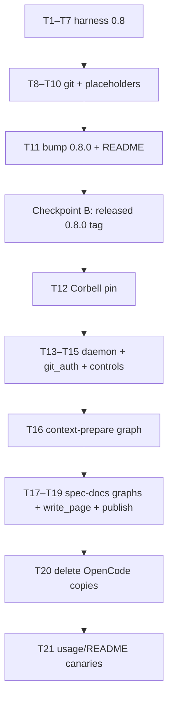

# Implementation Plan: Spec-Gen Agent-Core Adoption

Status: **approved by the user on 2026-08-26**; T1 done.

Spec: `docs/spec-spec-gen-agent-core-adoption.md`
Design: `docs/design-spec-gen-agent-core-adoption.md`
Agent-core detail: `docs/design-spec-gen-agent-core-adoption-agent-core.md`
Corbell detail: `Corbell/docs/design-spec-gen-agent-core-adoption.md`
Usage: `docs/usage-spec-gen-agent-core-adoption.md`
Todo: `docs/todo-spec-gen-agent-core-adoption.md`
Work type: non-Jira tooling; issue-tracker workflow is not applicable.

## Overview

Ship agent-core **0.8.0** with the frozen harness/git/prompt contracts, then
pin Corbell to that tag. Corbell runs `context-prepare` and `spec-docs` as
`WorkflowSpec` graphs, writers as a product `write_page` node, and wiki
publish through `update_refs_with_lease`. UTA and CR stay on last **0.7.x**.

## Architecture Decisions

- 0.8.0 matched pin; mixed 0.7 consumer / 0.8 core unsupported (ADR-005).
- Product runner is `Harness` from `create_configured_harness`;
  `SessionAffinity` wraps that protocol. The `"opencode"` adapter
  (`OpenCodeHarness`) is the 0.8 change site, not a Corbell import.
  `execute_agent_turn` does not own affinity.
- Cooldowns on process-lifetime `ModelHealthTracker`, not a function-local map.
- Wiki publish is `--atomic --force-with-lease` via `GitWorkspace.execute(path=repo_dir)`.
- Writer progress: per-wave `wave_results` + LWW `page_status` (ADR-015).
- Isolated-failure policy is a **behavior change** vs live `raise` after a
  DAG level.

## Dependency Graph

Agent-core tasks are sequential through the tag. Corbell does not start until
the released 0.8.0 tag exists.

## Requirement Coverage

| Source | Requirement / decision | Tasks |
| --- | --- | --- |
| spec R1 | Reuse first; no long-lived Corbell facade | T4, T5, T20 |
| spec R2 | 0.8.0 breaking; UTA/CR stay 0.7.x | T11, T12 |
| spec R3 / design harness | stdin/title/pure; session first + bootstrap iff set; tracker; JSON turns | T1–T7 |
| spec R4 / ADR-006 | identity; flock; multi-ref `--atomic` | T8, T9, T14, T19 |
| spec R5 | `render_placeholders`; wiki not in SecureArtifactStore | T10, T19 |
| spec R6 | TaskDaemon; controls; spec_tasks stay | T13, T15 |
| spec R7 / design YAML | WorkflowSpec graphs; LWW writer; `write_page` not agent_turn | T16–T18 |
| spec R8 | graph state small; `page_status` not page bodies | T16–T18 |
| spec R9 | wiki/graph/intents stay product | T16–T19 (product nodes) |
| spec R10 | delete OpenCode copies; pin test | T12, T20 |
| spec R11 / usage | README 0.8 notes; cancel/resume observable | T11, T15, T21 |
| design writer sandbox | `isolate_attempts=False` + lane factory | T18 |
| design isolated-failure change | unique pages; siblings continue; ≥4 or empty frontier fail | T17 |
| design `run_status` | mark_failed / promote; missing = corrupt | T16, T17 |
| usage | pin, daemon stop, rollback | T12, T15, T21 |

Out of coverage (explicit spec non-goals): human_gate, PublicationCoordinator
as wiki publisher, UTA/CR source migrations, leftover LLMClient CLI, promoting
intents/graph.

## Task List

### Phase A: Agent-core harness (0.8)

### T1. Process knobs: delivery, title, pure, env, project_dir  ✅

**Description:** `OpenCodeProcess.run_turn` accepts `delivery` (`argv`/`file`/`stdin`), `title`, `pure`, `env`, `project_dir` (`--dir`). Default remains argv/`--file` at 60k.

**Acceptance criteria:**
- [x] `delivery="stdin"` writes the prompt to child stdin, not argv.
- [x] Default path still argv/`--file`; `--pure` omitted when `pure=False`.

**Verification:** `.venv/bin/python -m pytest tests/test_harness_process.py` (or new `tests/test_harness_process_delivery.py`)
**Dependencies:** None
**Files likely touched:** `src/agent_core/harness/process.py`, `tests/test_harness_process.py`
**Estimated scope:** S

### T2. Fallback walker: session_id first, bootstrap iff set

**Description:** `run_turn_with_fallback` takes `session_id` (first candidate only) and `bootstrap_message`. Later candidates drop session; use bootstrap **iff set**, else original message/file.

**Acceptance criteria:**
- [x] Two-candidate test: bound model fails → second gets bootstrap, no `--continue`.
- [x] Two-candidate test without bootstrap: original file/message kept, session dropped.

**Verification:** pytest on `tests/test_harness_runner.py` (or new fallback tests)
**Dependencies:** T1
**Files likely touched:** `src/agent_core/harness/runner.py`, tests
**Estimated scope:** S

### T3. ModelHealthTracker windows and skip on `models=`

**Description:** rate_limit 60s, timeout 5m, keep 15m unavailable / 10m no_output. Skip unhealthy even when `models=` is set. Prefer last success. If all cooling, try anyway. Record last-success on completed.

**Acceptance criteria:**
- [x] Unhealthy model skipped on a **second** `run_turn_with_fallback` call (process-lifetime).
- [x] All-cooling still attempts a candidate.

**Verification:** pytest `tests/test_tiered_router.py` + runner tests
**Dependencies:** T2
**Files likely touched:** `src/agent_core/harness/tiered_router.py`, `runner.py`, tests
**Estimated scope:** M

### T4. Registered opencode adapter forwards message xor file and knobs

**Description:** In `OpenCodeHarness` (adapter only): stop swallowing `session_id`. Accept `message` xor `prompt_file`. Forward delivery/title/pure/env/project_dir/bootstrap_message into the walker. Map those knobs from `HarnessSpec.options`. Product tests construct via `create_configured_harness`, not `OpenCodeHarness(`.

**Acceptance criteria:**
- [x] Keyword `session_id` is not in `**_ignored`.
- [x] `isolate_attempts` default remains True (UTA/CR).

**Verification:** pytest `tests/test_harness_opencode.py`
**Dependencies:** T2, T3
**Files likely touched:** `src/agent_core/harness/opencode.py`, tests
**Estimated scope:** S

### T5. SessionAffinity is model-bound and wraps `Harness`

**Description:** Store `(session_id, model_id)`. `run(harness, key, …)` calls harness `run_turn`. Model match continues; mismatch uses bootstrap.

**Acceptance criteria:**
- [x] Model mismatch does not pass `--continue` with the old id.
- [x] Existing `session_id()` / `has_session()` / `reset()` still work.

**Verification:** pytest `tests/test_harness_affinity.py`
**Dependencies:** T4
**Files likely touched:** `src/agent_core/harness/affinity.py`, tests
**Estimated scope:** S

### T6. execute_agent_turn / run_harness_node accept str prompts

**Description:** Prompt callable may return `Path` or `str`. `str` → `message=`; `Path` → `prompt_file=`. Optional delivery/title/pure on the request. Affinity is **not** inside the executor.

**Acceptance criteria:**
- [x] Path-returning callables still work.
- [x] Str prompt reaches harness as `message`.

**Verification:** pytest `tests/test_agent_turn_normalized.py`
**Dependencies:** T4
**Files likely touched:** `src/agent_core/harness/node.py`, `execution.py`, tests
**Estimated scope:** M

### T7. Shared agent_turn: parse json and confined prompt files

**Description:** Config `parse: json` uses `extract_json_object`. Prompt file must be under `context["turn_dir"]` and must not be under `repo_path/docs/spec`. Fail closed otherwise.

**Acceptance criteria:**
- [x] JSON parse retries via existing attempts.
- [x] File under `docs/spec` raises before spawn.

**Verification:** pytest workflow node tests
**Dependencies:** T6
**Files likely touched:** `src/agent_core/workflow/nodes.py`, tests
**Estimated scope:** S

## Checkpoint A: Harness contract

- [x] T1–T7 tests green
- [x] Existing 0.7-shaped harness tests updated for tracker windows / session forwarding
- [x] Human review before git/prompt work

### Phase B: Git, placeholders, 0.8.0 tag

### T8. POSIX flock on GitWorkspace.repo_lock

**Description:** `fcntl.flock` plus in-process `RLock`. Production POSIX-only; Windows unsupported (no fake lock).

**Acceptance criteria:**
- [x] Two-process test: second holder blocks until first releases.
- [x] Same-process reentry still works.

**Verification:** pytest `tests/test_git_workspace.py`
**Dependencies:** None (can overlap Phase A after T1)
**Files likely touched:** `src/agent_core/git/workspace.py`, tests
**Estimated scope:** S

### T9. update_refs_with_lease

**Description:** `update_refs_with_lease(workspace, path, *, ref_updates, lease, is_cancelled=None)` runs one `execute(..., "push", "--atomic", *force-with-lease, "origin", *refspecs, check=True, is_cancelled=is_cancelled)`. Empty expected SHA is first claim.

**Acceptance criteria:**
- [x] Lease-lost: neither ref updated.
- [x] Remote rejecting `--atomic` raises.

**Verification:** pytest temp git repo two refs
**Dependencies:** T8
**Files likely touched:** `src/agent_core/git/publish.py` or `git/refs.py`, `git/__init__.py`, tests
**Estimated scope:** M

### T10. render_placeholders

**Description:** Exact `{{name}}` in `prompts.py`. Unknown names fail. Values are not re-expanded. Unused-key check stays in Corbell.

**Acceptance criteria:**
- [x] Value containing `{{` is inserted literally.

**Verification:** pytest prompt tests
**Dependencies:** None
**Files likely touched:** `src/agent_core/prompts.py`, tests
**Estimated scope:** S

### T11. Version 0.8.0, README break list, export new symbols

**Description:** Bump package version. README lists the 0.8 breaks (ADR-005 table). Export `render_placeholders`, `update_refs_with_lease`, `SessionAffinity.model_id`.

**Acceptance criteria:**
- [x] `pyproject.toml` version is `0.8.0`.
- [x] README names mixed-pair rule: last 0.7.x vs 0.8.

**Verification:** compileall + README grep
**Dependencies:** T1–T10
**Files likely touched:** `pyproject.toml`, `README.md`, `harness/__init__.py`, `git/__init__.py`
**Estimated scope:** M

## Checkpoint B: Released 0.8.0 tag

- [x] Full agent-core pytest green
- [x] Tag `v0.8.0` (or the shipped 0.8 tag) exists
- [x] UTA/CR **not** pointed at this tag
- [x] Human review before Corbell pin

### Phase C: Corbell pin and daemon

### T12. Pin Corbell to released 0.8.0

**Description:** `agent-core[api,langgraph,yaml] @ v0.8.0`. Align `langgraph>=1.0,<2.0`. Pin test refuses any other installed version.

**Acceptance criteria:**
- [x] Import fails closed on 0.7.x or unpinned main.
- [x] Extras include langgraph and yaml.

**Verification:** pin unit test + `pytest -q --collect-only`
**Dependencies:** Checkpoint B
**Files likely touched:** `Corbell/pyproject.toml`, new `agent_core_pin.py` or equivalent, tests
**Estimated scope:** S

### T13. TaskDaemon + DaemonPorts

**Description:** Replace `TaskScheduler.run_forever` / embedded worker loop with `TaskDaemon`. Claim/execute/renew_lease/maintenance stay product ports. Execute wraps wiki-dir backup, `open_checkpointer`, `invoke_workflow` (identity minted here on retry).

**Acceptance criteria:**
- [x] Existing claim SQL still admits work.
- [x] Repo+branch lease renew is the port, not core runner heartbeat.

**Verification:** `tests/test_task_scheduler_orchestration.py` retargeted
**Dependencies:** T12
**Files likely touched:** `core/tasks/scheduler.py`, `api.py`, tests
**Estimated scope:** M

### T14. git_auth → identity; publish helper later

**Description:** Replace `core/git_auth.py` callers with `agent_core.git.identity`. Keep dual-ref checkout product code.

**Acceptance criteria:**
- [x] No production `git_subprocess_env` copy.

**Verification:** pytest remote_project / git tests
**Dependencies:** T12
**Files likely touched:** `core/git_auth.py`, `core/tasks/remote_project/*`, tests
**Estimated scope:** S

### T15. Core controls for stop/cancel

**Description:** Drop unused `spec_task_control`. Wire `request_control` into OpenCode `is_cancelled`. HTTP `POST /api/v1/spec-tasks/{id}/stop` and CLI. Intent cancel stays desired-state pause.

**Acceptance criteria:**
- [x] Cancelled turn is task failure, not `{}` JSON.
- [x] Intent cancel does not kill a running child by itself.

**Verification:** `tests/test_tasks.py`, API tests
**Dependencies:** T13
**Files likely touched:** `core/tasks/db.py`, `core/ui/server.py`, CLI, tests
**Estimated scope:** M

## Checkpoint C: Daemon on 0.8

- [x] Pin test + scheduler tests green
- [x] Stop/cancel proven
- [x] Human review before graph YAML (user requested continuation from Phase C)

### Phase D: Corbell graphs and cleanup

### T16. context-prepare WorkflowSpec

**Description:** YAML + product nodes. Hash-skip from stage evidence. Keyword/planner via `agent_turn`. Nested identity `WorkflowRunIdentity`. `run_status` on END. Missing `run_status` is corrupt.

**Acceptance criteria:**
- [x] Resume after crash continues next node; matching graph_build hash does not rebuild.
- [x] Failed inner lineage is not `reused_completed` success.

**Verification:** new topology + resume tests
**Dependencies:** T13
**Files likely touched:** `core/workflows/context-prepare.yaml`, `flow.py`, `context_prepare.py`, tests
**Estimated scope:** M

### T17. spec-docs-service writer wave + LWW page_status

**Description:** YAML fanout from `select_page_batch` over `page_batch`, join `join_pages`, collect `wave_results`. Select uses `_page_write_batches(..., context_pack=)` then excludes failed. `writer_join_outcome` on unique failures. `mark_failed` / promote set `run_status`.

**Acceptance criteria:**
- [x] One isolated failure: siblings proceed; failed path not re-Sent; parent of failure not written.
- [x] Review retry of an `ok` page produces another Send after `page_status` retry.
- [x] Unique failures ≥ 4 or empty frontier with failures → `mark_failed`.
- [x] `over: write_order` never in YAML.

**Verification:** topology tests with parent/child and same-seed
**Dependencies:** T16, T5, T4
**Files likely touched:** `core/workflows/spec-docs-service.yaml`, `flow.py`, writer nodes, tests
**Estimated scope:** M

### T18. write_page product node + sandbox

**Description:** Cost port + `SessionAffinity` around a `Harness` from `create_configured_harness(HarnessSpec(name="opencode", options=…))`. Options carry `isolate_attempts=False` and the lane-scratch factory (`HOME`/`PATH`/`OPENCODE_CONFIG`/`--dir`/page-lint). `MODEL_BUDGET` non-isolatable. Stdin delivery. Rotation: max_turns and `should_rotate`. No product import of `OpenCodeHarness`.

**Acceptance criteria:**
- [x] Prompt bytes not under `docs/spec` and not in checkpoint JSON.
- [x] Failover second candidate gets bootstrap.
- [x] `rg OpenCodeHarness spec_generator_agent` has no production hits.

**Verification:** retargeted `test_final_doc_workflow.py` / driver tests
**Dependencies:** T17
**Files likely touched:** writer node module, `handlers/clients.py`, tests
**Estimated scope:** M

### T19. Outer spec-docs graph + atomic publish

**Description:** `select_next_service` loop, nested service invoke, aggregate, `update_refs_with_lease(path=repo_dir)`. No MR.

**Acceptance criteria:**
- [x] Sequential services; nested `reused_completed` only when `run_status=ok`.
- [x] Lease-lost updates neither ref.

**Verification:** outer topology + publish fixture
**Dependencies:** T17, T9, T14
**Files likely touched:** `core/workflows/spec-docs.yaml`, publication handler, tests
**Estimated scope:** M

### T20. Delete Corbell OpenCode copies

**Description:** Remove `OpenCodeCliProcess` / fallback / shutdown / `run_json` spawn path. Tests use `FakeOpenCodeProcess.run_turn`.

**Acceptance criteria:**
- [x] `rg OpenCodeCliProcess` has no production hits.
- [x] Shutdown uses `install_shutdown_handlers`.

**Verification:** rg + pytest
**Dependencies:** T18
**Files likely touched:** `core/opencode/*`, tests
**Estimated scope:** M

### T21. Docs and operator canaries

**Description:** Refresh usage/README. Record pin, stop, resume, rollback. Operator canaries from usage: cancel, SIGTERM resume, dry-run spec-docs.

**Acceptance criteria:**
- [x] Usage matches frozen design (LWW writer, unique-failure policy).
- [x] Corbell ADR-015 linked from README or docs index.

**Verification:** doc review
**Dependencies:** T20
**Files likely touched:** `docs/usage-spec-gen-agent-core-adoption.md`, Corbell README
**Estimated scope:** S

## Checkpoint D: Complete

- [x] All Corbell pytest listed in the spec green
- [x] Source-boundary rgs pass
- [x] UTA/CR still on last 0.7.x
- [x] Ready for human ship review

## Risks and Mitigations

| Risk | Impact | Mitigation |
| --- | --- | --- |
| 0.8 harness break silently used by UTA/CR | High | They stay pinned to 0.7.x; pin tests |
| Writer DAG / LWW bugs | High | T17 tests before deleting ThreadPool |
| Non-atomic push if `--atomic` omitted | High | T9 contract test; T19 uses helper only |
| Recursion limit mid-write | Medium | T17 tests a large single-level write-order |
| Continuation prompt on fresh model | High | T2 + T18 two-candidate tests |

## Open Questions

None for implementation. SpecGenAgent uses the final patch tag `v0.8.3`.

## Parallelization

- T8 and T10 can proceed in parallel with T1–T3.
- Corbell T14 can overlap T13 after T12.
- T16 can start once T13 exists even if T15 is still open, but stop/cancel should land before live daemon use.
