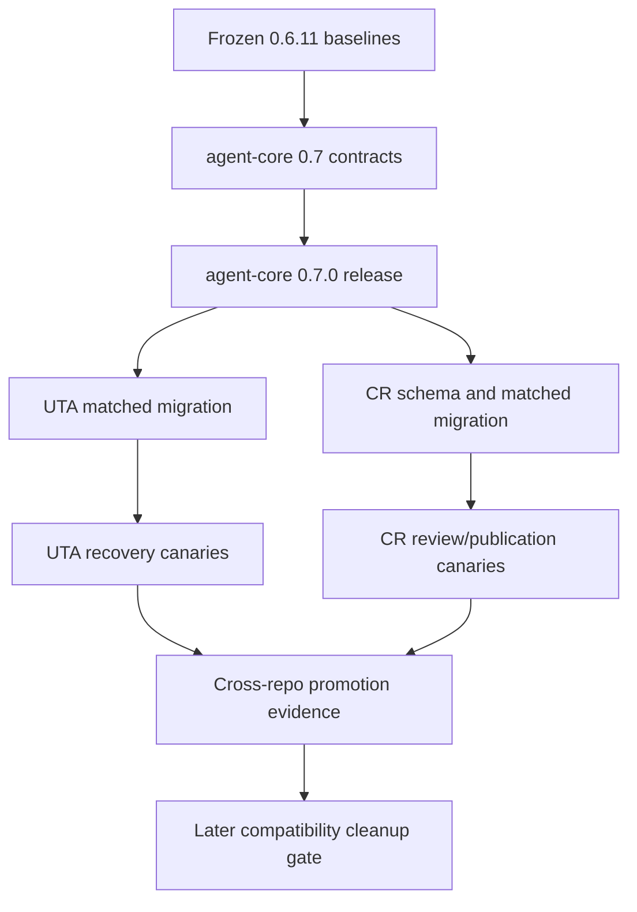

# Implementation Plan: Workflow Persistence and Common Capabilities

Status: in progress since 2026-08-21. T1–T18 and Checkpoints A–D are
complete; UTA T19–T27 are done except rollback rehearsal; CR T28–T31
are done on `workflow-persistence-0.7`; T32 is next.

Spec: `docs/spec-workflow-persistence-and-common-capabilities.md`
Design: `docs/design-workflow-persistence-and-common-capabilities.md`
Agent-core detail: `docs/design-workflow-persistence-and-common-capabilities-agent-core.md`
UTA detail: `unit-test-agent/docs/design-workflow-persistence-and-common-capabilities.md`
CR detail: `cr_plugin/docs/design-workflow-persistence-and-common-capabilities.md`
Usage: `docs/usage-workflow-persistence-and-common-capabilities.md`
Work type: non-Jira architecture/tooling; issue-tracker release evidence is not
applicable by the approved spec.

## Overview

Deliver a coordinated agent-core 0.7 contract and matching UTA/CR migrations.
LangGraph remains the sole graph-checkpoint engine; agent-core owns only secure
lineage lifecycle and common agent, artifact, prompt, diagnostics, and publication
mechanics; each product retains its task persistence, side-effect reconciliation,
business policy, and retention eligibility. The implementation is sequenced so
old consumers stay on 0.6.11 until 0.7.0 is released, and mixed breaking pairs
fail before workers acquire work.

## Architecture Decisions

- Pass the native LangGraph saver directly; keep stable identity and disposition
  policy in agent-core and side-effect evidence in products.
- Use one typed `execute_agent_turn` lifecycle for LangGraph and direct callers;
  retain `run_harness_node` as the only attempt/parse/accept loop.
- Promote secure mechanics, not UTA/CR policy: exact artifacts, prompt bundles,
  neutral sessions/diagnostics, and Git/MR orchestration move to agent-core.
- Release agent-core first, then update consumers to a released 0.7.x tag. Old
  consumer/new-core and new-consumer/old-core combinations are unsupported.
- Preserve CR additive legacy projections for one compatibility window and keep
  UTA checkpoint/operation identities, prompt bytes, and retention order stable.

## Dependency Graph

Tasks that change shared APIs are sequential through T18. UTA and CR consumer
migrations may proceed in parallel only after the released 0.7 contract exists.
Within CR, schema/repository work precedes workflow and presentation changes.

## Phase 0: Freeze The Compatible Baseline

### T1. Pin and verify the 0.6.11 consumer pair

**Description:** Stop CR tracking agent-core `main`, verify UTA's existing 0.6.11
pin, and prove both old consumers install and start with that released version.

**Acceptance criteria:**
- CR and UTA dependency metadata resolve exactly agent-core 0.6.11.
- Both consumers reject accidental 0.7 installation before their migration.

**Verification:** clean-environment install plus each consumer's startup/import
smoke test.
**Dependencies:** None.
**Files likely touched:** `cr_plugin/pyproject.toml`, consumer lock files,
dependency-version tests.
**Estimated scope:** M (3–5 files).

### T2. Freeze agent-core checkpoint and turn contracts

**Description:** Capture current thread IDs, disposition behavior, callback order,
turn DTO JSON, fallback refs, and paid-attempt traces before breaking APIs.

**Acceptance criteria:**
- Fixtures cover absent, pending, completed, and corrupt checkpoint states.
- Success/failure/cancel/guard/fallback traces fail on semantic drift.

**Verification:** `.venv/bin/python -m pytest tests/test_checkpoints.py
tests/test_workflow_execution.py tests/test_agent_turn_normalized.py`.
**Dependencies:** T1.
**Files likely touched:** the three named tests and fixture data.
**Estimated scope:** M.

### T3. Freeze UTA operation, prompt, and retention contracts

**Description:** Freeze operation identity/path/hash envelopes, all seven
reconciliation outcomes, prompt bytes, checkpoint thread IDs, and deletion order.

**Acceptance criteria:**
- Existing operation artifacts rehydrate through frozen fixtures.
- Retention remains checkpoint → operation artifacts → operation rows → prompts.

**Verification:** focused operation, prompt, workflow-application, and retention
tests.
**Dependencies:** T1.
**Files likely touched:** UTA operation/prompt/retention tests and fixtures.
**Estimated scope:** M.

### T4. Freeze CR persistence and publication compatibility

**Description:** Freeze old schema versions, endpoint session aliases, prompt and
reference bytes, direct-turn outcomes, and publication first/update/failure shapes.

**Acceptance criteria:**
- Every session-bearing table and endpoint has a legacy snapshot.
- Reviewer, judge, feedback, retrospective, and publication baselines are pinned.

**Verification:** CR schema, workflow, prompt, feedback, and publication suites.
**Dependencies:** T1.
**Files likely touched:** CR fixture files and focused tests only.
**Estimated scope:** M.

## Checkpoint A: Baseline Approval

- [x] T1–T4 are green in clean environments.
- [x] Frozen bytes, IDs, result JSON, and call traces are reviewed.
- [x] Old consumers remain deployable on 0.6.11 before agent-core breaks API.

## Phase 1: Native Workflow And Secure Runtime Foundations

### T5. Yield the native LangGraph saver

**Description:** Remove `WorkflowCheckpointer` forwarding and make
`open_checkpointer` validate the managed root, open/setup the native saver,
enforce owner-only modes, yield it, and close deterministically.

**Acceptance criteria:**
- Graph compilation receives the concrete saver returned by LangGraph.
- Unsafe roots, symlinks, overlap, permission drift, and missing extras fail closed.

**Verification:** real SQLite saver lifecycle and source-boundary tests.
**Dependencies:** Checkpoint A.
**Files likely touched:** `workflow/checkpoints.py`, `tests/test_checkpoints.py`,
workflow exports.
**Estimated scope:** M.

### T6. Preserve invocation and public lineage deletion

**Description:** Type `invoke_workflow` against native saver/compiled graph and add
capability-checked `delete_checkpoint_lineage` without private checkpoint SQL.

**Acceptance criteria:**
- Start/resume-with-`None`/completed-reuse/corruption semantics remain exact.
- Unsupported or inherited-not-implemented deletion raises the typed error and
  leaves other lineages intact.

**Verification:** workflow execution and multi-lineage deletion integration tests.
**Dependencies:** T5.
**Files likely touched:** `workflow/execution.py`, `workflow/checkpoints.py`, two
focused test modules.
**Estimated scope:** M.

### T7. Implement confined atomic artifact writes and reads

**Description:** Replace the weak artifact implementation with strict path/root
validation, private atomic writes, bounded immutable comparison, digests, and
verified reads for bytes/text/JSON.

**Acceptance criteria:**
- Traversal, absolute/option-like paths, symlinks, overlap, wrong modes, NaN JSON,
  changed bytes, and excessive reads are rejected.
- Atomic writes fsync/replace deterministically and preserve UTF-8/JSON bytes.

**Verification:** artifact property and injected temp-write/fsync/rename tests.
**Dependencies:** Checkpoint A.
**Files likely touched:** `runtime/artifacts.py`, optional shared path helper,
`tests/test_runtime_artifacts.py`.
**Estimated scope:** M.

### T8. Add bounded namespace locking and exact deletion

**Description:** Add the fixed 256-slot owner-only lock set, typed layouts/indexed
files, partial-file recovery, non-blocking active-lock refusal, and exact deletion.

**Acceptance criteria:**
- Arbitrarily many namespaces leave exactly 256 lock files.
- Unknown, malformed, symlink, active, or layout-incompatible entries stop deletion.

**Verification:** subprocess kill/lock and exact-layout deletion tests.
**Dependencies:** T7.
**Files likely touched:** `runtime/artifacts.py`, `tests/test_runtime_artifacts.py`,
subprocess fixture helper.
**Estimated scope:** M.

## Checkpoint B: Persistence Boundary

- [x] Real LangGraph lifecycle tests pass without a forwarding saver.
- [x] No core/product module uses checkpoint-table SQL.
- [x] Artifact fault/security suite passes under process interruption.

## Phase 2: Canonical Turn Execution And Diagnostics

### T9. Define neutral sessions and move normalized turn DTOs

**Description:** Add syntax-only `AgentSessionRef`/scope validation, ordered
deduplication, plural refs on `TurnResult`/`TurnRecord`, and move normalized turn
DTO ownership out of workflow into harness.

**Acceptance criteria:**
- Every fallback/recovery candidate ref is preserved in stable order.
- Package import without LangGraph remains supported and old singular source is
  absent from the 0.7 public API.

**Verification:** session serialization, deduplication, result normalization, and
optional-extra import tests.
**Dependencies:** T2.
**Files likely touched:** `harness/sessions.py`, `harness/records.py`,
`harness/turn_result.py`, focused tests.
**Estimated scope:** M.

### T10. Make cost accounting surround every paid submission

**Description:** Thread one monotonic ordinal and mandatory before/after cost hooks
through retry, fallback, and recovery, reporting unknown after submitted exceptions.

**Acceptance criteria:**
- Ordinals never reset across nested retry/fallback/recovery.
- Attempt N is recorded before N+1 admission; known/zero/missing aggregate without
  partial-authoritative cost.

**Verification:** runner/fallback tests with known, zero, unknown, exception, and
second-attempt rejection traces.
**Dependencies:** T9.
**Files likely touched:** `harness/runner.py`, `harness/node.py`, fallback/session
module, runner tests.
**Estimated scope:** M.

### T11. Add the typed canonical turn executor

**Description:** Implement `HarnessBinding`, request/context/result DTOs and narrow
ports, then centralize validation, cancellation, session, guard, progress, cost,
result, recorder, and observer ordering around `run_harness_node`.

**Acceptance criteria:**
- Direct callers receive exact `NodeOutcome` plus normalized result.
- Required-capability, cancellation, rejection, progress failure, and result-port
  ordering are typed and frozen before paid work.

**Verification:** ordered call-trace and direct executor contract tests.
**Dependencies:** T9, T10.
**Files likely touched:** new `harness/execution.py`, `harness/node.py`, harness
exports, new executor test.
**Estimated scope:** M.

### T12. Make LangGraph `agent_turn` a projection adapter

**Description:** Project state/config into the typed request/context and project
only JSON-safe normalized output back, deleting callback-key lifecycle behavior.

**Acceptance criteria:**
- Direct and graph invocation produce identical ordered executor traces.
- No live port/client/settings object enters graph state and callback-map support
  is absent from 0.7.

**Verification:** normalized agent-turn and declarative graph tests plus source scan.
**Dependencies:** T11.
**Files likely touched:** `workflow/nodes.py`, workflow exports,
`tests/test_agent_turn_normalized.py`.
**Estimated scope:** S–M.

### T13. Define bounded diagnostics contracts

**Description:** Add the closed available/unsupported/unavailable union, neutral
usage/model/step/signal DTOs, hard limits, provider protocol, and aggregation rules.

**Acceptance criteria:**
- Mixed availability removes report-level totals without hiding per-item data.
- Input limits raise before partial totals; output detail truncation is explicit.

**Verification:** diagnostics DTO, bounds, aggregation, JSON-safety, and sanitizer
tests.
**Dependencies:** T9.
**Files likely touched:** new `harness/diagnostics.py`, harness exports, new tests.
**Estimated scope:** M.

### T14. Implement durable OpenCode session diagnostics

**Description:** Expose process/native locator scopes correctly and implement the
read-only two-query bounded diagnostic collector beside the OpenCode adapter.

**Acceptance criteria:**
- Offline restart diagnosis works from the native durable locator.
- Schema/storage drift is typed unavailable; row/total limits prevent payload
  parsing and raw provider data never escapes.

**Verification:** adapter DB fixtures for restart, schema drift, limits,
multi-session totals, and sanitization.
**Dependencies:** T10, T13.
**Files likely touched:** `harness/opencode.py`, adapter-private diagnostics module,
OpenCode diagnostic tests.
**Estimated scope:** M.

## Checkpoint C: Turn Contract

- [x] All registered harness adapters call the mandatory per-submission cost hooks.
- [x] Direct and LangGraph turn traces match.
- [x] Neutral refs and diagnostics expose no raw provider payload or reasoning.

## Phase 3: Prompt And Publication Capabilities

### T15. Materialize manifest-last prompt bundles

**Description:** Extend `PromptLibrary` with immutable prompt/input/reference files,
deterministic versioned manifest, locked completion, verification, and bounded
rematerialization of recognized incomplete bundles.

**Acceptance criteria:**
- Manifest is last, sorted, metadata-only, and verifies every listed byte.
- Unicode/golden prompt bytes remain exact; unsafe reference names and conflicting
  complete bundles fail.

**Verification:** prompt byte/manifest goldens and crash-before-manifest tests.
**Dependencies:** T7, T8.
**Files likely touched:** `prompts.py`, `tests/test_prompts.py`, golden fixtures.
**Estimated scope:** M.

### T16. Close the Git publication outcome algebra

**Description:** Add pushed/reused/no-change variants, distinct base/publish branch
handling, stable publication markers, allowed-path enforcement, and remote-SHA
verification for first and update publication.

**Acceptance criteria:**
- Push-before-MR retry returns `REUSED_PUBLISHED` without repush.
- Unexpected paths, rebase conflict, push failure, and SHA mismatch prevent forge work.

**Verification:** real-Git first/update/race/reuse/path-refusal tests with exact call
counts.
**Dependencies:** T2.
**Files likely touched:** `git/publish.py`, `git/workspace.py`,
`tests/test_git_publish.py`, workspace tests.
**Estimated scope:** M.

### T17. Add idempotent MR publication coordination

**Description:** Add `PublicationCoordinator` and neutral MR protocol, including
pre-create lookup, one create, ambiguity lookup, manual URL, partial success, and
owner-only workspace cleanup.

**Acceptance criteria:**
- Existing/created/manual/failed/not-requested results remain distinct after a
  verified push.
- Ambiguous API failure cannot duplicate an MR or repeat Git publication.

**Verification:** fake-forge matrix plus real-Git workspace cleanup fixtures.
**Dependencies:** T16.
**Files likely touched:** `git/publish.py`, `integrations/gitlab.py`,
`tests/test_gitlab.py`, publication tests.
**Estimated scope:** M.

### T18. Release the breaking agent-core 0.7 contract

**Description:** Update exports, dependency bounds, version, README/API/usage and
release notes; remove old saver, callback mapping, singular session, and old Git
result exports; build and tag only after human release checkpoint.

**Acceptance criteria:**
- Wheel/sdist install with and without optional extras behaves as documented.
- Full/focused suites and source-boundary scans pass; tag resolves to verified
  0.7.0 artifacts.

**Verification:** `.venv/bin/python -m pytest`, compileall, build, clean-wheel
import tests, and tag/ref verification.
**Dependencies:** T5–T17, Checkpoints B/C.
**Files likely touched:** `pyproject.toml`, public `__init__` modules, `README.md`,
usage/release notes.
**Estimated scope:** M.

## Checkpoint D: Agent-Core Release

- [x] Human approves the breaking API diff and removal list.
- [x] agent-core 0.7.0 is built, tagged, pushed, and independently installable.
- [x] Consumers remain on 0.6.11 until their matching migration begins.

## Phase 4: UTA Matched Migration

### T19. Pin UTA to 0.7 and use the native saver

**Description:** Pin the released tag, align LangGraph bounds, pass the repository
as forbidden root, compile with the native saver, and preserve all thread IDs.

**Acceptance criteria:**
- No UTA production import names `SqliteSaver` or constructs thread config.
- Start/resume/reuse/corrupt application behavior and identity fixtures remain exact.

**Verification:** UTA application/standalone tests and checkpoint source scan.
**Dependencies:** T18.
**Files likely touched:** UTA `pyproject.toml`, `graph/application.py`, dependency
lock, application tests.
**Estimated scope:** M.

### T20. Migrate checkpoint-first retention

**Description:** Replace wrapper deletion with `delete_checkpoint_lineage` while
preserving progress and product-evidence ordering and stop-on-first-failure behavior.

**Acceptance criteria:**
- Unsupported deletion retains every later artifact/row/prompt.
- Successful deletion removes only the exact selected lineage before product data.

**Verification:** UTA workflow-retention and scheduler tests.
**Dependencies:** T19.
**Files likely touched:** `uta/app/retention.py`, task retention coordinator,
retention tests.
**Estimated scope:** M.

### T21. Compose UTA typed turn contexts

**Description:** Implement narrow UTA cancellation/session/guard/progress adapters
at the workflow application boundary and remove callback-key mappings from graph
construction.

**Acceptance criteria:**
- Application startup validates required ports before task execution.
- Java/Python routes share core executor without product DB/manager entering state.

**Verification:** testgen port/application tests and package-dependency scan.
**Dependencies:** T19.
**Files likely touched:** `graph/application.py`, UTA turn-context adapter module,
cycle binding tests.
**Estimated scope:** M.

### T22. Preserve UTA result durability and cap-aware cost policy

**Description:** Adapt ledger result and accounting ports, including capped unknown
cost blocking the next candidate and uncapped bounded continuation with unavailable
aggregate.

**Acceptance criteria:**
- Known/zero/unknown/fallback/recovery costs are exact and idempotent.
- Guard rejection retains audit/cost but never creates reusable accepted evidence.

**Verification:** UTA cost-gate, operation-ledger, and fallback/recovery tests.
**Dependencies:** T21.
**Files likely touched:** `operations/cost_gate.py`, `operations/ledger.py`, UTA
turn adapters, focused tests.
**Estimated scope:** M.

### T23. Back operation artifacts with the secure store

**Description:** Keep UTA envelope/identity/error facade while delegating bytes,
hashing, locks, verified reads, and exact deletion to `SecureArtifactStore` at the
existing paths.

**Acceptance criteria:**
- Old artifacts read unchanged and all seven reconciliation outcomes remain exact.
- Path/hash/permission/conflict errors still map to the UTA validation boundary.

**Verification:** operation artifact, ledger reconciliation, and crash-window tests.
**Dependencies:** T18.
**Files likely touched:** `operations/artifact_store.py`, operation facade exports,
operation artifact tests.
**Estimated scope:** S–M.

### T24. Migrate UTA prompts to secure bundles

**Description:** Retain scope/root/lease/metadata policy, add manifest path to graph
state, materialize core bundles, and rematerialize only recognized incomplete data.

**Acceptance criteria:**
- Prompt/input bytes and standalone layout/cleanup remain frozen.
- Complete conflict fails indeterminate; missing manifest recovers under lock.

**Verification:** prompt artifacts/render/golden, cycle resume, delivery-boundary,
and standalone tests.
**Dependencies:** T15, T19.
**Files likely touched:** `testgen/prompts/artifacts.py`, `graph/cycle.py`,
`graph/cycle_state.py`, focused tests.
**Estimated scope:** M.

### T25. Persist and project neutral UTA session refs

**Description:** Add JSON-safe turn/aggregate refs to cycle state and migrate usage,
retrospective, accounting, and report projections away from provider-shaped clients.

**Acceptance criteria:**
- Every fallback ref survives checkpoint/restart; legacy string projections remain
  snapshot-compatible.
- New internal code never selects a harness by parsing a session ID.

**Verification:** state serialization, fallback, session usage, retrospective, and
report tests.
**Dependencies:** T14, T21.
**Files likely touched:** `graph/cycle_state.py`, `session_usage.py`,
`session_analysis.py`, projection tests.
**Estimated scope:** M.

### T26. Make `uta assess` a diagnostics consumer

**Description:** Remove OpenCode DB reads from UTA, add neutral harness/limit options,
retain UTA comparison/model buckets, and keep one-release `--db-path` compatibility.

**Acceptance criteria:**
- Supported/unsupported/unavailable/limit-exceeded are distinct from zero.
- Public output contains no private summaries/raw rows; OpenCode access is adapter-only.

**Verification:** assessment CLI JSON/table and placement/source-boundary tests.
**Dependencies:** T14, T25.
**Files likely touched:** `app/opencode_assessment.py`, `app/assessment_commands.py`,
assessment tests.
**Estimated scope:** M.

### T27. Prove UTA recovery parity and update operations docs

**Description:** Run scripted Java/Python normal, interrupted-resume, completed-reuse,
and standalone flows; update README/architecture/usage with native checkpoint versus
operation truth and sanitized observability.

**Acceptance criteria:**
- No resumed/reused canary repeats an expensive turn; terminal operation evidence
  validates and retention order remains exact.
- Package policy proves enforcement tools/bindings remain independent of agent-core.

**Verification:** full UTA suite, Ruff, dependency checker, build/install, and beta
evidence queries from the design.
**Dependencies:** T20–T26.
**Files likely touched:** UTA README/usage/architecture docs, E2E fixtures, canary
evidence template.
**Estimated scope:** M.

## Checkpoint E: UTA Promotion

- [x] UTA uses released agent-core 0.7.x as a matched pair.
- [x] Normal/resumed/reused Java and Python evidence passes without identity drift.
- [ ] Rollback restores UTA source plus agent-core 0.6.11 together.

## Phase 5: CR Matched Migration

### T28. Pin CR to 0.7 and isolate legacy harness configuration

**Description:** Move from 0.6.11 to released 0.7.x, add neutral concurrency, and
confine legacy OpenCode settings to a one-release app-composition adapter.

**Acceptance criteria:**
- Workflow modules read only neutral harness/configuration names.
- Neutral values win conflicts; warnings are bounded and contain no option values.

**Verification:** clean install/startup and configuration matrix/source scan.
**Dependencies:** T18 and completed T1 baseline.
**Files likely touched:** CR `pyproject.toml`, `config.py`, legacy adapter,
configuration tests.
**Estimated scope:** M.

### T29. Add CR neutral session and cost schema

**Description:** Add plural session JSON, nullable provider cost, and strict
provenance columns to all three tables through the existing idempotent migration.

**Acceptance criteria:**
- Fresh/every-prior/repeated migration works with old rows marked legacy-unverified.
- No backfill invents authoritative cost or session data.

**Verification:** CR schema migration matrix and previous-version rollback fixture.
**Dependencies:** T4.
**Files likely touched:** `review/data/schema.py`, schema migration tests/fixtures.
**Estimated scope:** S–M.

### T30. Implement CR neutral read/write compatibility

**Description:** Add strict session JSON codecs and table-specific dual-read/write
rules, atomically persisting refs, usage, provider cost, and provenance on finish.

**Acceptance criteria:**
- Neutral wins mismatch; invalid neutral JSON fails; historic fallback is OpenCode
  only after the pre-cutover audit assumption is verified.
- Generic legacy fields receive every harness latest locator; provider field only
  receives OpenCode; unknown cost is NULL/unavailable.

**Verification:** runs/feedback/retrospective repository matrix and old-reader tests.
**Dependencies:** T9, T29.
**Files likely touched:** `data/runs.py`, `data/feedback_sessions.py`,
`data/retrospective.py`, repository tests.
**Estimated scope:** M.

### T31. Build the CR turn-context factory and recorder bridge

**Description:** Compose binding/cancellation/progress/cost/result/recorder adapters
once at app wiring and preserve durable STARTED-before-provider and atomic finish.

**Acceptance criteria:**
- Review, feedback, and retrospective services receive the factory explicitly.
- Process death leaves STARTED evidence; finish writes every candidate ref and cost
  provenance in the existing transaction.

**Verification:** services/control/recording tests with kill and guard-rejection
fixtures.
**Dependencies:** T11, T30.
**Files likely touched:** workflow services/composition, `workflow/recording.py`,
new context adapter, focused tests.
**Estimated scope:** M.

### T32. Migrate reviewer and judge turns

**Description:** Route reviewer/judge direct calls through `execute_agent_turn`
while preserving product prompt, parse, accept, retry, findings, and rejection policy.

**Acceptance criteria:**
- Frozen outcomes/events/reports match and no duplicate attempt loop remains.
- Cancellation/progress/guard/session behavior uses the shared ordered lifecycle.

**Verification:** reviewer, judge, retry, finding-attribution, and report snapshots.
**Dependencies:** T31.
**Files likely touched:** `workflow/reviewer.py`, `workflow/judging.py`, pipeline
judge adapter, focused tests.
**Estimated scope:** M.

### T33. Migrate feedback and retrospective turns

**Description:** Route feedback session and retrospective summary/triage model calls
through the same executor while preserving their distinct durable pre-call markers.

**Acceptance criteria:**
- Feedback running row and retrospective source item exist before paid work.
- Terminal refs/cost/provenance and product outcomes remain atomically correct.

**Verification:** feedback flow/session and retrospective flow/triage tests.
**Dependencies:** T31.
**Files likely touched:** feedback session turn/recording modules, retrospective
service/triage modules, focused tests.
**Estimated scope:** M.

### T34. Migrate CR reviewer and judge private artifacts

**Description:** Use exact secure layouts for context, reviewer outputs/attempts,
judge outputs, and rejections while leaving authenticated report outputs excluded.

**Acceptance criteria:**
- All private writes are bounded, owner-only, confined outside reviewed repos, and
  verified before use.
- Source boundary allows only named report/publication direct-write exceptions.

**Verification:** context/reviewer/judge artifact path, symlink, mode, fault, and
write-inventory tests.
**Dependencies:** T8, T32.
**Files likely touched:** `pipeline/context.py`, `workflow/reviewer.py`,
`workflow/judging.py`, artifact tests.
**Estimated scope:** M.

### T35. Migrate CR retrospective private artifacts

**Description:** Move changed-file, diff, evidence, and summary artifacts to the
retrospective exact layout without changing retention or product semantics.

**Acceptance criteria:**
- Existing readable evidence and names remain stable.
- Unexpected/symlink/partial entries fail exact deletion and remain inspectable.

**Verification:** retrospective evidence/repository security and retention tests.
**Dependencies:** T8, T33.
**Files likely touched:** retrospective `evidence.py`, `repository.py`, layout
constant module, focused tests.
**Estimated scope:** M.

### T36. Migrate CR prompts to manifest-last bundles

**Description:** Use core bundles for reviewer, judge, feedback, and retrospective
prompts while preserving mixed output directories, reference paths, and exact bytes.

**Acceptance criteria:**
- Prompt/input/reference goldens remain byte-identical and manifest verifies them.
- Missing manifest recovers safely; conflicting complete identity fails.

**Verification:** pipeline prompt and all flow-specific prompt manifest goldens.
**Dependencies:** T15, T34, T35.
**Files likely touched:** `pipeline/prompts.py`, feedback/retrospective preparation,
prompt tests/fixtures.
**Estimated scope:** M.

### T37. Migrate feedback-pattern publication

**Description:** Retain CR content/digest/branch/title policy but delegate isolated
workspace, scoped Git, verified reuse, MR ensure, manual URL, and cleanup to core.

**Acceptance criteria:**
- First/update/target-move/race/timeout retry produces no duplicate push, branch, or MR.
- `FeedbackPatternSyncResult` remains API-compatible and unexpected paths fail.

**Verification:** real-Git publication fixtures and fake GitLab matrix.
**Dependencies:** T17, T28.
**Files likely touched:** feedback pattern `publication.py`, `sync.py`, app
composition, publication tests.
**Estimated scope:** M.

### T38. Project CR neutral sessions through reports and APIs

**Description:** Make plural refs authoritative in internal/presentation models,
derive latest convenience, and emit provider-named aliases only for OpenCode during
the compatibility window.

**Acceptance criteria:**
- Every endpoint snapshot matches the table-specific alias matrix.
- Public output contains no private artifact path, raw diagnostics, or false zero cost.

**Verification:** endpoint/report snapshots and legacy-name source-boundary scan.
**Dependencies:** T30, T32, T33.
**Files likely touched:** presentation/contracts, report projection, API serializers,
snapshot tests.
**Estimated scope:** M.

### T39. Prove CR parity, rollback, and update docs

**Description:** Run review/judge/feedback/retrospective/artifact/publication canaries,
verify pre-cutover OpenCode-only history, and update README/architecture/usage and
rollback procedure.

**Acceptance criteria:**
- Canary refs match OpenCode aliases, artifacts verify, findings/reports are unchanged,
  and publication remote SHA/MR outcome is recorded.
- Rollback blocks while non-terminal unavailable-cost rows exist and restores the
  CR+0.6.11 pair together.

**Verification:** full CR suite, compileall/build, clean install, audit query, and
canary evidence checklist.
**Dependencies:** T28–T38.
**Files likely touched:** CR README/architecture/usage, canary/audit scripts or
evidence templates, rollout tests.
**Estimated scope:** M.

## Checkpoint F: CR Promotion

- [ ] CR uses released agent-core 0.7.x as a matched pair.
- [ ] All four turn families, secure artifacts/prompts, and publication canaries pass.
- [ ] Rollback and legacy session/cost visibility are proven before general traffic.

## Phase 6: Cross-Repository Promotion And Later Cleanup

### T40. Run the matched-pair cross-repository release gate

**Description:** Verify released refs, clean wheel installs, complete suites/builds,
dependency/source boundaries, disposition metrics, and documentation in all repos.

**Acceptance criteria:**
- No mixed version pair starts; supported pairs pass full default and fault suites.
- Started/resumed/reused counters, expensive-turn counts, artifact failures, session
  mismatches, and publication outcomes meet the design thresholds.

**Verification:** exact commands in the spec/usage plus remote tag/pin verification.
**Dependencies:** Checkpoints E and F.
**Files likely touched:** cross-repo evidence record and final README/API mirrors.
**Estimated scope:** S–M.

### T41. Complete production canary and soak evidence

**Description:** Observe at least one normal, resumed, and completed-reuse workflow
per supported product flow, and stop promotion on any identity/replay/security/SHA
mismatch.

**Acceptance criteria:**
- UTA terminal evidence agrees with checkpoint disposition and no paid node repeats.
- CR session projections/artifacts/publication remain consistent with no sanitized
  mismatch events.

**Verification:** approved design metrics/log queries and retained canary evidence.
**Dependencies:** T40.
**Files likely touched:** evidence artifacts and operator changelog only.
**Estimated scope:** S.

### T42. Gate the one-release compatibility cleanup

**Description:** After the documented release/soak window, scan reads/writes/data and
prepare a separately approved cleanup that stops CR legacy writes while retaining
read fallback until schema removal is approved.

**Acceptance criteria:**
- Repository scans and stored-row audits prove no active consumer requires removed
  internal/provider aliases.
- Physical column removal or early read-fallback deletion remains out of scope until
  separately approved.

**Verification:** source/data compatibility report and rollback rehearsal.
**Dependencies:** T41 and one completed compatibility release window.
**Files likely touched:** compatibility adapter/tests and cleanup proposal docs.
**Estimated scope:** S–M.

## Checkpoint G: Complete

- [ ] Every requirement-coverage row below has passing task evidence.
- [ ] No Critical/Important review finding remains.
- [ ] All three repositories are clean, pushed, and point to mutually compatible refs.
- [ ] The later compatibility cleanup is either completed under separate approval or
      remains explicitly gated with its readers intact.

## Requirement Coverage

| Source | Requirement / design decision | Covered by tasks | Notes |
| --- | --- | --- | --- |
| Spec R1 | Native saver; no forwarding/schema/private SQL; secure roots; public deletion | T5, T6, T19, T20 | Real LangGraph integration is mandatory. |
| Spec R2 | Start, pending resume, completed reuse, corruption refusal, clean identity | T2, T6, T19, T27, T40–T41 | Identity fixtures precede implementation. |
| Spec R3 | Checkpoints separate from product effects; UTA ledger/cost/reconciliation retained | T3, T22, T23, T27, T40 | Host-kill cost gap remains the approved exception. |
| Spec R4 | Confined atomic private artifacts, bounded reads, locks, exact deletion | T7–T8, T23, T34–T35 | Product identity/eligibility stays outside core. |
| Spec R5 | One typed executor, one attempt loop, typed ports, direct + graph callers | T9–T12, T21–T22, T31–T33 | No mapping compatibility API in 0.7. |
| Spec R6 | Neutral plural sessions and bounded optional diagnostics | T9–T10, T13–T14, T25–T26, T29–T30, T38 | Raw provider data is forbidden. |
| Spec R7 | Exact prompt/input/reference bundle and manifest-last recovery | T15, T24, T36 | Product templates/bytes remain owned/frozen. |
| Spec R8 | Shared scoped publication, branch distinction, reuse, idempotent MR ensure | T16–T17, T37, T40–T41 | UTA scoped subset remains covered by its gate. |
| Spec R9 | Consumer cleanup, exact pins, additive CR compatibility and provenance | T1, T18–T22, T28–T33, T38–T42 | Mixed version pairs fail before workers start. |
| Spec R10 | Ownership docs and bounded observability without private payloads | T18, T26–T27, T38–T41 | Usage/README mirrors are explicit deliverables. |
| Success 1 | Native saver compiles workflows; no saver forwarders | T5–T6, T18 | Source and real-saver tests both gate removal. |
| Success 2 | All checkpoint dispositions, topology isolation, and deletion pass | T2, T5–T6, T19–T20, T40 | Corruption never becomes absence. |
| Success 3 | Products do not own saver construction/config/table SQL | T6, T19–T20, T28, T40 | Cross-repo source scan is final authority. |
| Success 4 | UTA reconciliation and terminal validation remain unchanged | T3, T22–T23, T27 | Every crash window and seven outcomes are frozen. |
| Success 5 | One secure artifact implementation serves UTA and CR | T7–T8, T23, T34–T35 | Existing readable artifact compatibility is tested. |
| Success 6 | UTA graph and CR direct nodes share the canonical executor | T11–T12, T21–T22, T31–T33 | No callback map or duplicate attempt loop remains. |
| Success 7 | Neutral sessions preserve fallback refs and durable diagnostics | T9–T10, T13–T14, T25–T26, T29–T30, T38 | Unsupported is explicit, never zero. |
| Success 8 | UTA and CR prompt artifacts use deterministic secure bundles | T15, T24, T36 | Golden prompt bytes remain exact. |
| Success 9 | Shared publication is idempotent; UTA scoped publish remains safe | T16–T17, T27, T37, T40 | First/update/race/timeout and remote SHA are covered. |
| Success 10 | Product persistence/enforcement/language/policy ownership stays outside core | T18, T21, T27–T28, T31, T40 | Dependency gates protect the boundary. |
| Success 11 | Full/fault/build/compile/dependency suites pass in all repos | T18, T27, T39–T40 | Clean-environment artifacts are required. |
| Success 12 | Core tag and both consumer pins reference verified releases | T18–T19, T28, T40 | Remote ref verification is part of the gate. |
| Success 13 | Documentation explains checkpoint versus operation evidence | T18, T27, T39–T40 | README, architecture, usage, and ADRs stay aligned. |
| Design | UTA cap-aware unknown-cost policy | T10, T22, T27 | Capped blocks next attempt; uncapped bounded chain may continue. |
| Design | UTA retention ordering and failure stop | T3, T20, T27 | No approved ordering change. |
| Design | CR STARTED-before-call and atomic terminal enrichment | T4, T30–T33, T39 | Result port does not replace attempt durability. |
| Design | CR exact table dual-write/read and rollback matrix | T4, T29–T30, T38–T39, T42 | Historic values are legacy-unverified. |
| Design | Diagnostics hard limits and no partial report totals | T13–T14, T26 | 32 sessions, 1 MiB row, 64 MiB raw total, etc. |
| Design | Fixed striped locks and exact namespace layouts | T8, T23, T34–T35 | No unbounded lock inode growth. |
| Design | `REUSED_PUBLISHED` and MR ambiguity recovery | T16–T17, T37 | Retry never repushes verified content. |
| Design | Coordinated 0.6.11 → 0.7 matched rollout/rollback | T1, T18–T19, T28, T39–T41 | Shared API repo releases first. |
| Usage | Operator checkpoint/artifact/diagnostics/publication procedures | T18, T26–T27, T39–T41 | No release-approval evidence file. |
| ADR-002 | Native checkpointer plus separate UTA evidence | T5–T6, T19–T23 | Accepted 2026-08-21. |
| ADR-003 | Typed canonical agent-turn execution | T9–T12, T21–T22, T31–T33 | Accepted 2026-08-21. |
| ADR-004 | Centralize mechanics, retain product policy | T7–T8, T13–T17, T23–T26, T34–T38 | Accepted 2026-08-21. |

No task is orphaned: each maps to a requirement/design/ADR row. No approved
requirement is deferred except T42's explicitly later, separately approved
physical compatibility cleanup.

## Risks And Mitigations

| Risk | Impact | Mitigation |
| --- | --- | --- |
| Resume misclassification repeats paid repository-changing work | Critical | Freeze IDs/call counts, real saver tests, UTA reconciliation, staged canaries. |
| Stronger storage rejects existing unsafe roots | High | Fail closed with exact path; operator repairs only the managed root. |
| Cost/session refs are lost across fallback or guard rejection | High | One ordinal/ref union, pre-call durable markers, atomic terminal tests. |
| Prompt migration changes bytes or path semantics | High | Golden bytes/paths before migration and manifest-last mixed-directory tests. |
| Publication pushes an unintended path or duplicates an MR | High | Exact allowlist, remote SHA verification, stable publication ID, ambiguity lookup. |
| CR rollback converts unknown cost to zero | High | Provenance columns, rollback block on non-terminal unavailable rows, matched pair. |
| Consumer migration overlaps unrelated architecture work | Medium | Start only from clean committed consumer branches; keep tasks ≤5 files. |
| Optional dependency drift | Medium | Bounded dependency ranges and clean install tests with/without extras. |

## Open Questions

None. The approved design and fourth independent review resolved the API,
ordering, compatibility, security, capacity, and rollout decisions. Any change to
checkpoint identity, UTA reconciliation/retention, CR schema beyond the approved
additive columns, dependency ranges, or public alias window returns to spec/design
approval before implementation.
